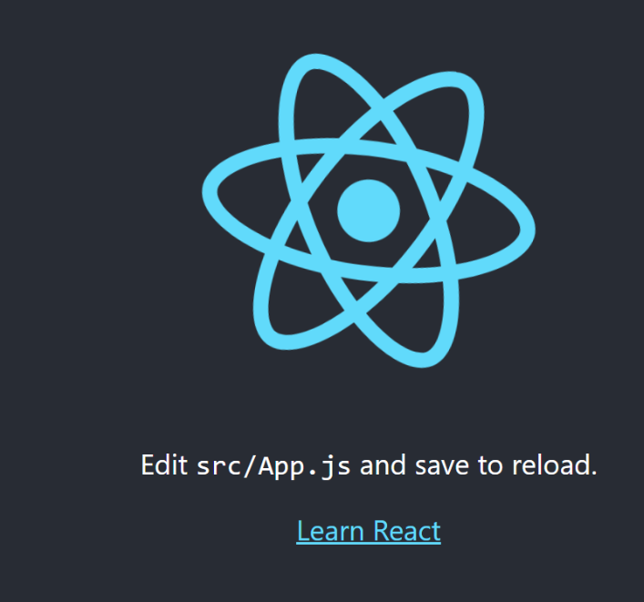

# 1. react 라이브러리 활용을 위한 환경 구축

- `npx create-react-app exam_blog` 명령어로 프로젝트 생성하기 !
- vsCode를 활용해서 terminal에서 `npm start`로 테스트 해보기
( package.json 없다고 하면 cd exam_blog로 폴더 이동할 것 )
( 아래 화면이 나오면 성공 !)
- 

# 2. app.js와 app.css를 사용해보기
- 먼저  app.js  안에서 기존처럼 div로 분단을 나누고 `
` 으로 사용할 것 같지만,  
기존과 다르게  JSX  ( javascript 안에서 html을 쉽게 사용하게 해주는 부가적인 언어라고 생각하자 )  
`
` 으로 사용하면 된다 !

-  app.css  에서 .name { } 으로  css 를 사용하여 꾸미면 된다.

 
