<!-- post 폴더 이름 -> 연관성을 찾지못함 ( 이상하게 바꿔도 정상적으로 작동했기때문 ) -->


## 0. 공부하다 참고할 만한 내용들
- 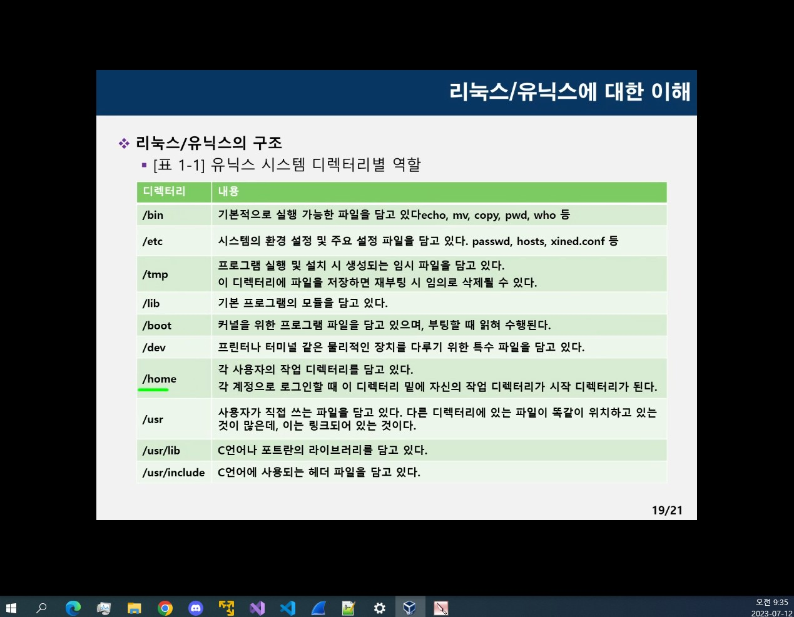


## 1. 외워야 하는 필수적인 것들

### 1-1. 시스템 CPU의 구조
```
보기전에 먼저 그려보기
```

- 연산장치는 ALU ( Arithmetic and Logic Unit )라고 부르며 산술과 논리 연산을 수행하는 연산 회로 집합으로 구성

<details>
<summary> 정답 </summary>
<div markdown="1">
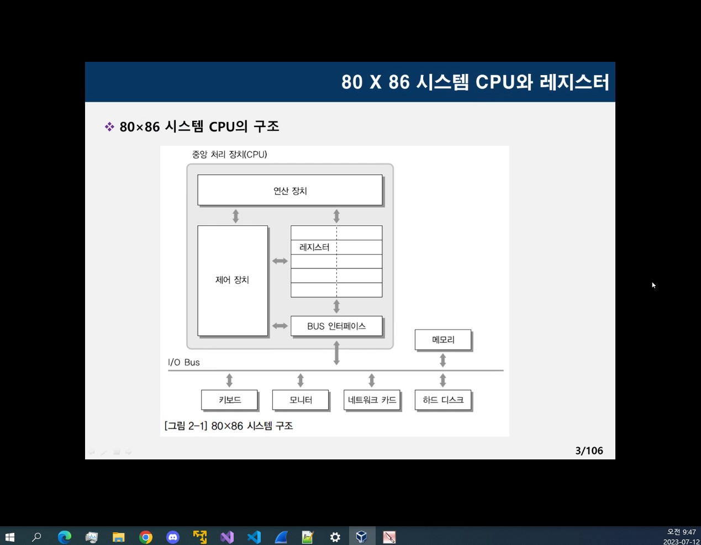  
</div>
</details>

### 1-2. 레지스터의 종류와 용도 16가지
```
정답 보기전에 무조건 꼭 !! 적어서 어디를 까먹었는지 체크할 것
```

<details>
<summary> 정답 </summary>
<div markdown="1">
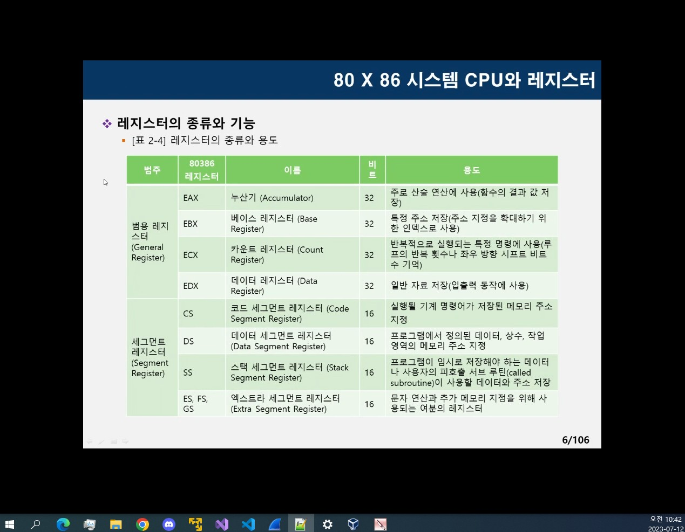
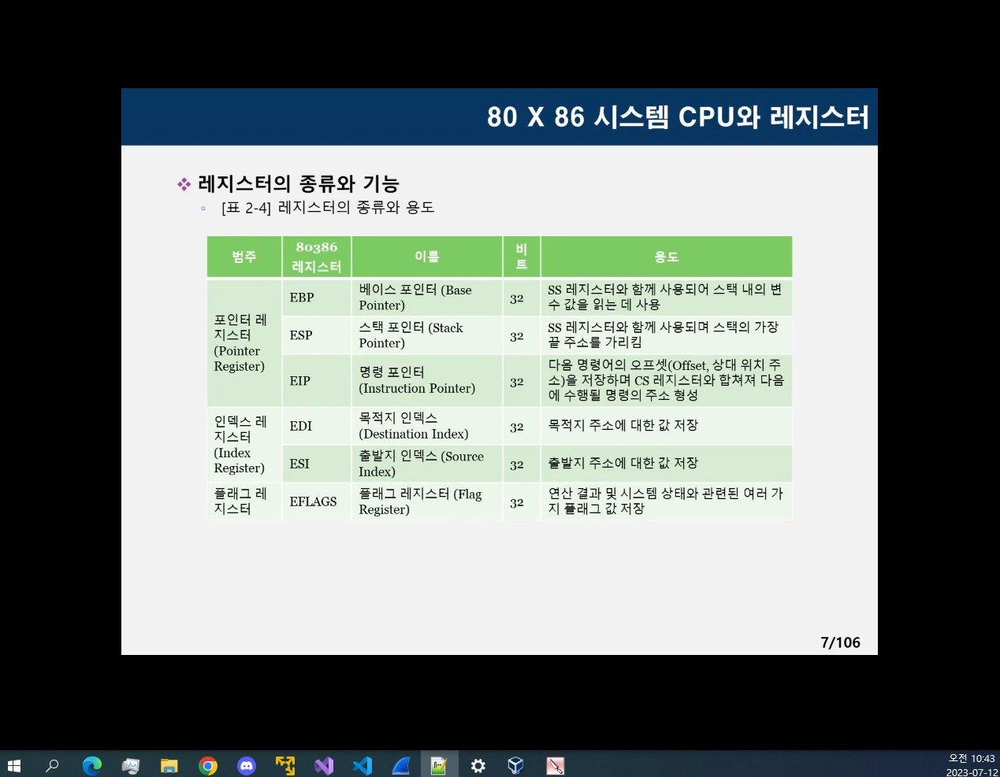
</div>
</details>

### 1-3. 범용 레지스터란
```
질문.
AL은 무엇인가?
```

<details>
<summary> 정답 </summary>
<div markdown="1">
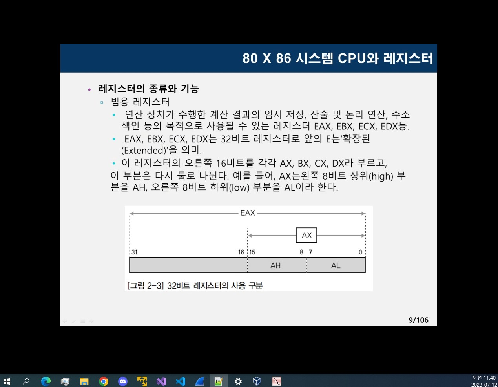  
</div>
</details>


### 1-4. 메모리의 기본 구조
```
진짜 엄청 중요함
stack과 heap 등의 차이점을 명확하게 나타내주는 그림을 그려봐
그리고 stack과 heap의 차이점을 글로 설명까지 해야됨 !
```

<details>
<summary> 정답 </summary>
<div markdown="1">
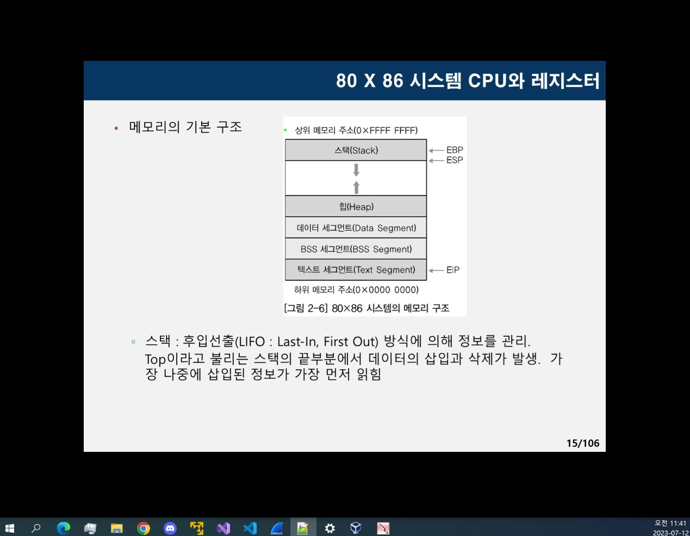  
</div>
</details>

### 1-5. 오프셋 레지스터에 따른 세그먼트 레지스트
```
용도를 외우면 외고 있겠지만,
떠오르는데 시간이 걸리므로 복습 영역에 넣어놨음.
바로 바로 떠올려야해
```

<details>
<summary> 정답 </summary>
<div markdown="1">
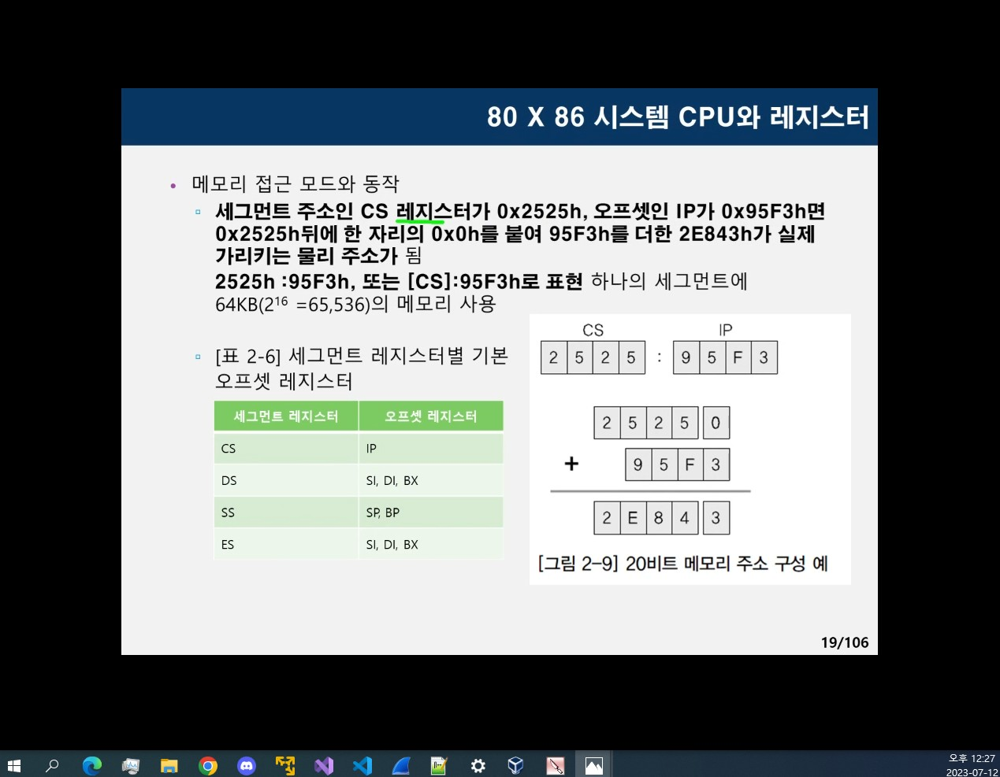  
</div>
</details>


## 2. 어셈블리어

### 2-1. 어셈블리어의 구조
```
Question
1. 어셈블리어에는 (  )문법과 (  )문법이 있다.
2. 윈도우에서는 (  )문법을 사용
3. 리눅스에서는 (  )문법을 사용
4. (  )문법에서는 목적지(Destination)가 먼저 오고 원본(Source)가 뒤에 위치한다.
5. (  )문법에서는 반대로 적용된다.

아래에 있는 문법은 어떤 문법의 형식이고 각각의 자리에 설명을 할 수 있어야 한다.
        Label       :       AX,     BX          
        (    )            (    )  (    )
```

<details>
<summary> 정답 </summary>
<div markdown="1">
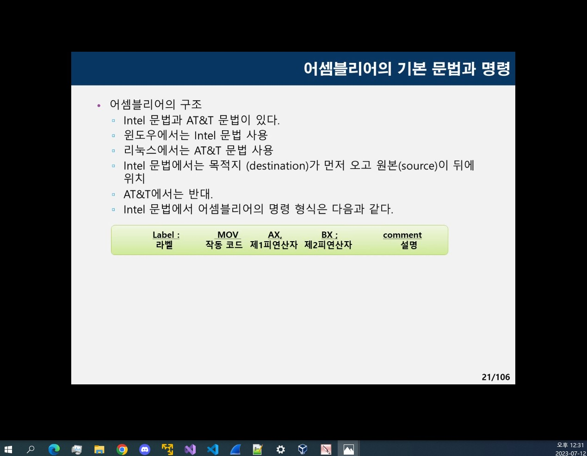 
</div>
</details>


### 2-2. 어셈블리어의 데이터 타입과 엔디언의 2가지 방식
```
Question
1. 어셈블리어의 데이터 타입 3가지의 이름과 크기는? ( 일부로 답을 적어놓지 않았다. )
2. 엔디언의 2가지 종류를 말하고 어떤 방식인지 그림을 그려 설명해보자
ex) 0x12345678 이라는 hex값이 있고
주소는 1000번지 1001번지 1002번지 1003번지
각각 어디에 어떻게 들어갈지 설명해보자. 
```


<details>
<summary> 정답 </summary>
<div markdown="1">
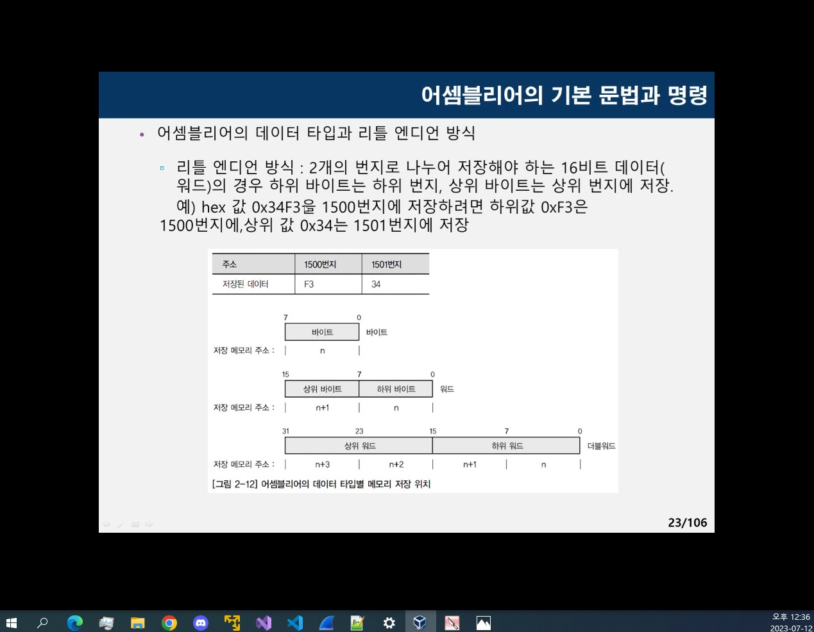  
</div>
</details>


### 2-3. 어셈블리어의 연산
1. MOV AX [BP+8] 이라는 어셈블리어 명령을 보았을 때 어떻게 되는지 설명하자. ( Intel 문법이라는 가정 )
   - 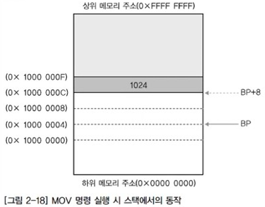 
2. LEA가 무엇인지 어떤 역할을 하고 MOV와 어떤 것이 다른지 설명해보자.
3. REP가 무엇인지 어떤 역할을 하는지 설명해보자.
4. 아래의 명령어들은 어떤 기능을 하는지 자세하게 설명해보자
        CLD
        LEA  SI, string_1
        LEA  DI, string_2
        MOV  CX, 384
  REP   MOVSB
5. 제어 전송 명령 중 대표적인 명령어 5개는 어떤 것이 있고 어떤 기능을 할까?
6. 아래 명령어들은 어떻게 되는지 반복 한 번만 설명해보자. 
   string:      CALL     SUBR
                ADD      AX,        10h
                ...
        SUBR:   INC      AX
                ...
                RET


<details>
<summary> 개념과 정답 </summary>
<div markdown="1">

```
1. MOV는 대입하는 명령어이고, Intel이라는 가정이면 뒤가 원본이고, 앞이 목적지이다.
    그러므로 BP의 <u>주소</u> 값에 8을 더한 곳의 1024라는 값이 AX 레지스터에 대입된다.
    그림 상에 AX가 없는 이유는 그림은 메모리를 나타내고 있고, AX는 CPU의 레지스터에 있기 때문이다.
2. LEA ( Load Effective Address to Register )라고 부르며 MOV와 다른 이유는 예시를 들면,
    MOV AX [BP+8]은 BP라는 <u>주소 값</u>에 8을 더 해준 곳의 값을 AX 레지스터에 대입하지만,
    LEA AX [BP+8]은 BP라는 주소 <u>안에있는 값에</u> 8을 추가 연산으로 처리한 값을 AX 레지스터에 대입한다. 
3. REP는 반복하는 명령으로써, ADD나 MOVS같은 작동 코드의 앞에서 위치하여 한 번 실행이 될 때마다 CX의 값이 1씩 감소하고, 0이 되었을 때 중단하게 된다.
4.      CLD 플래그 값을 0으로 만든다.
        string_1이라는 주소값을 SI(Source Index)에 저장
        string_2이라는 주소값을 DI(Destination Index)에 저장
        384라는 값을 CX 레지스터에 대입
   REP  MOVSB로 SI값을 DI에 전송하며, CX값을 1 감소 시키고, 0이 되면 종료 ( 1 바이트씩 384 바이트를 전송하겠다는 뜻 ) MOVS B 는 Byte니까.
5. JMP, conditional JMP, call, RET, Loop
6. 처음에 CALL 명령어로 인해 SUBR 라벨이 있는 곳으로 이동한다.
    INC AX 명령어로 인해 AX의 값이 1증가 한다
    RET 명령어로 EIP와 함께 CALL했던 부분으로 가서 CALL 밑에서부터 시작한다.
    AX 레지스터에 10h 값을 추가하게 된다.
    ( ...에서 종료를 하든 무한으로 돌든 일단 여기까지 설명. )


문제풀이 할 때 너무 어려우면 볼 수 있는 개념들
```
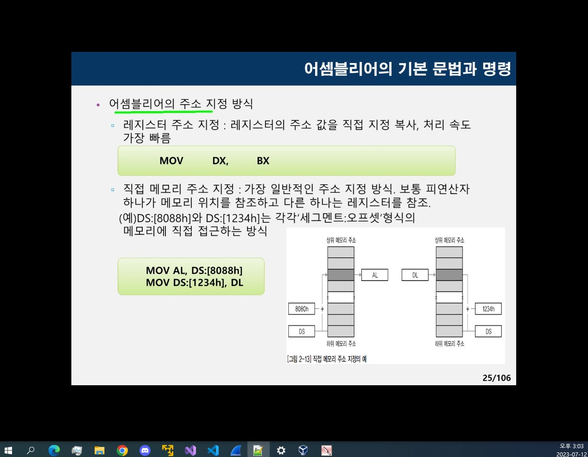  
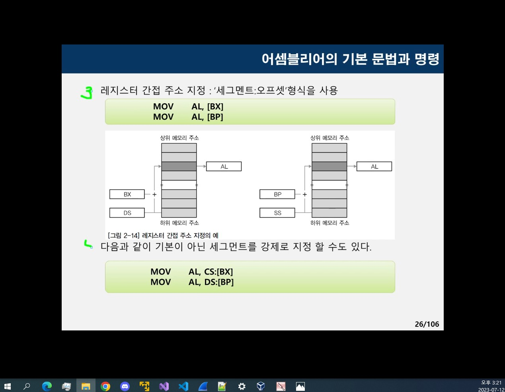  
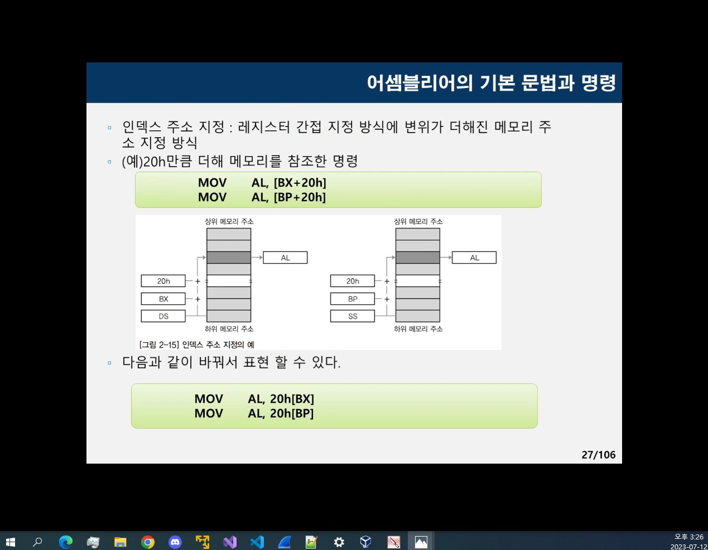  
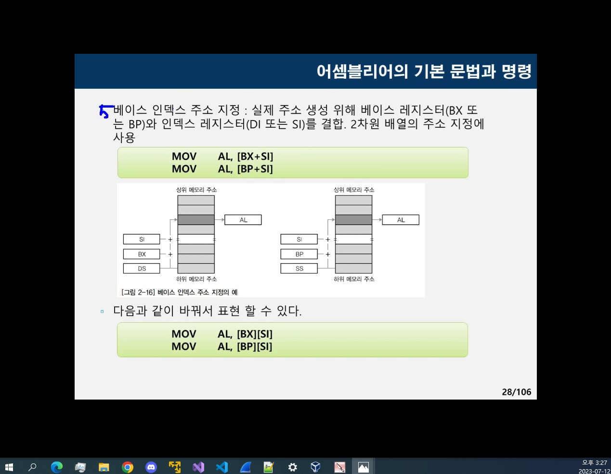  
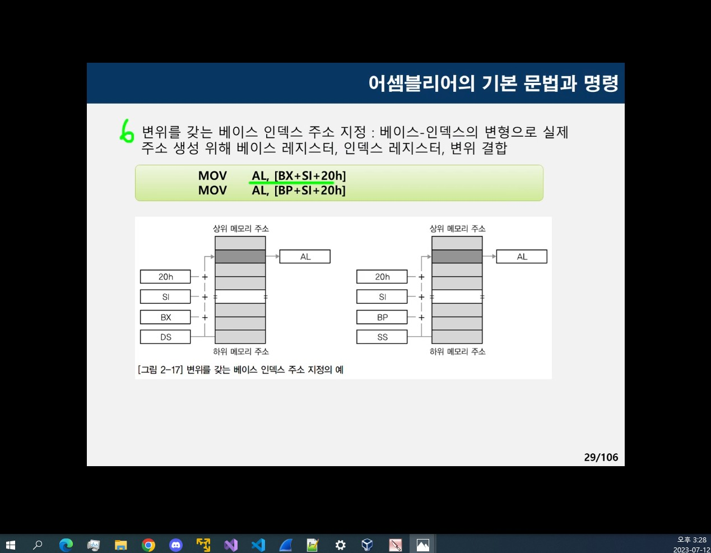  
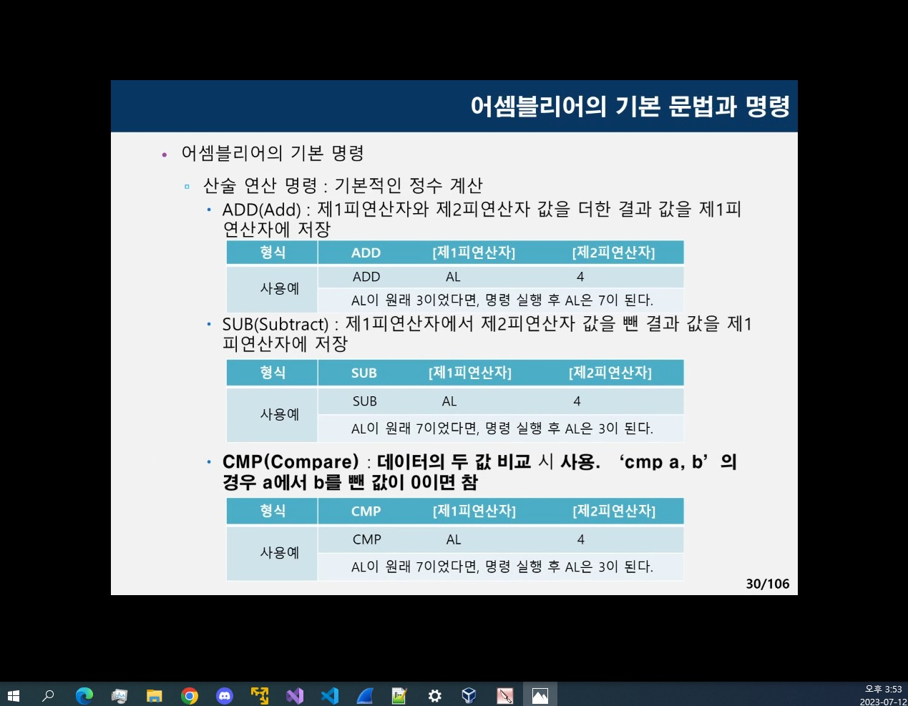 
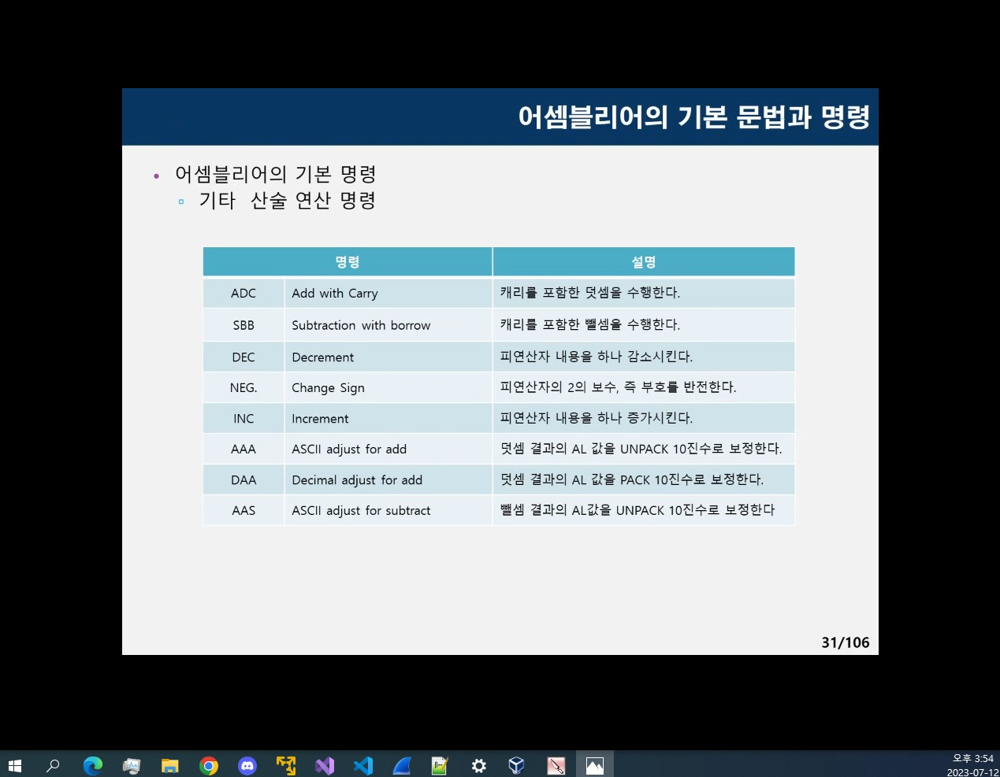  
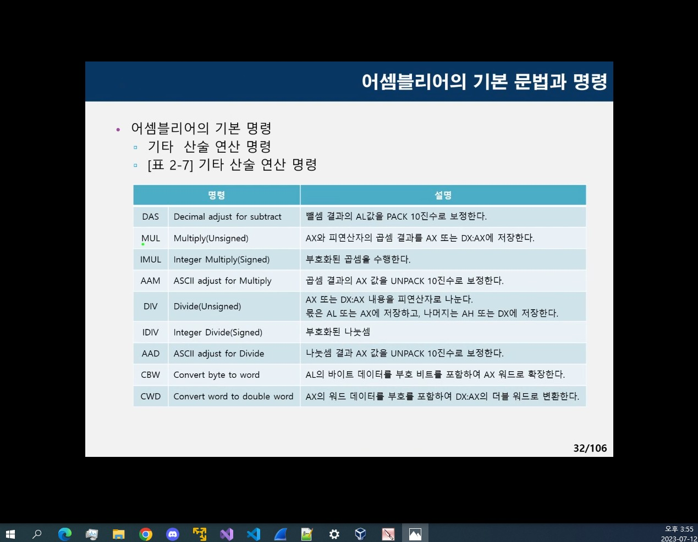  
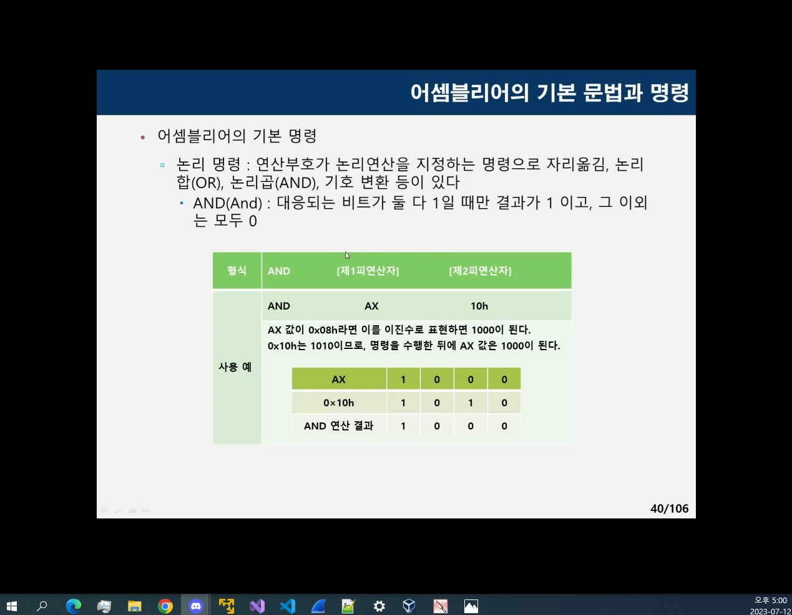  
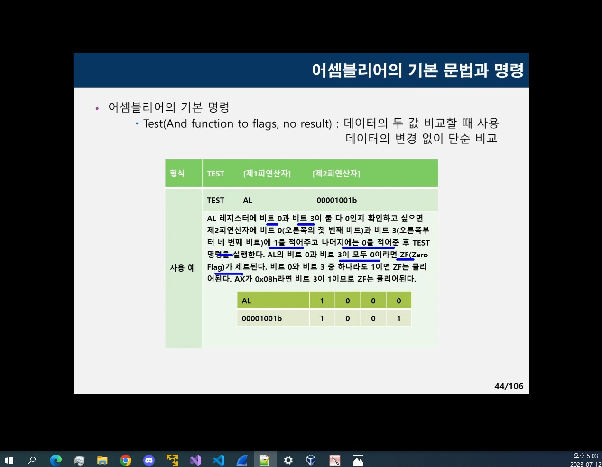  
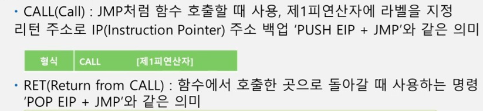  
</div>
</details>