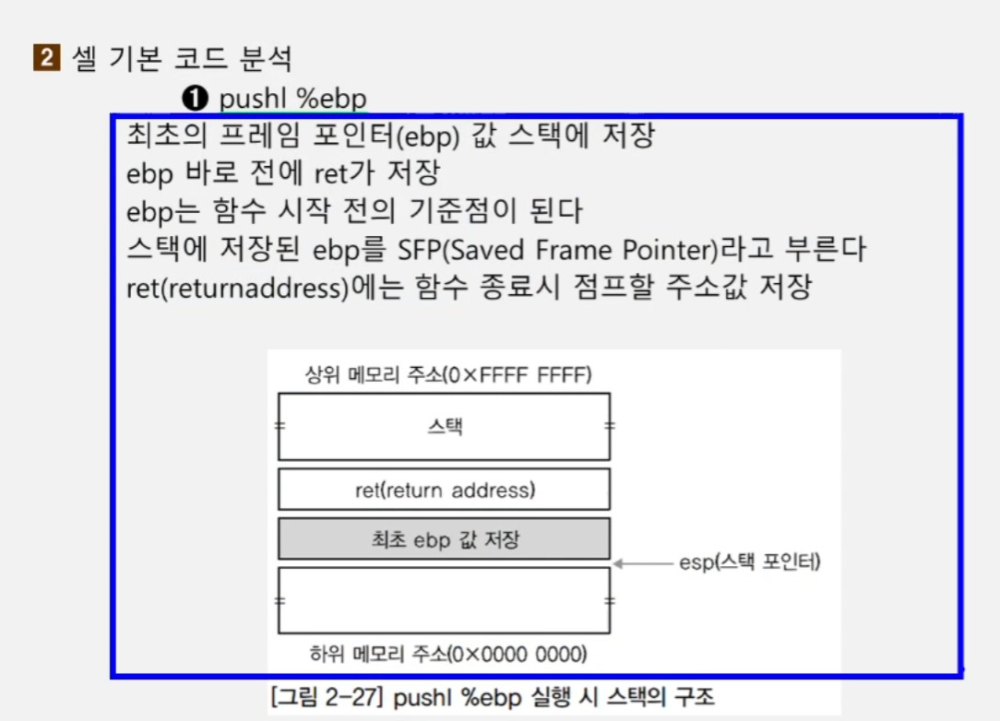
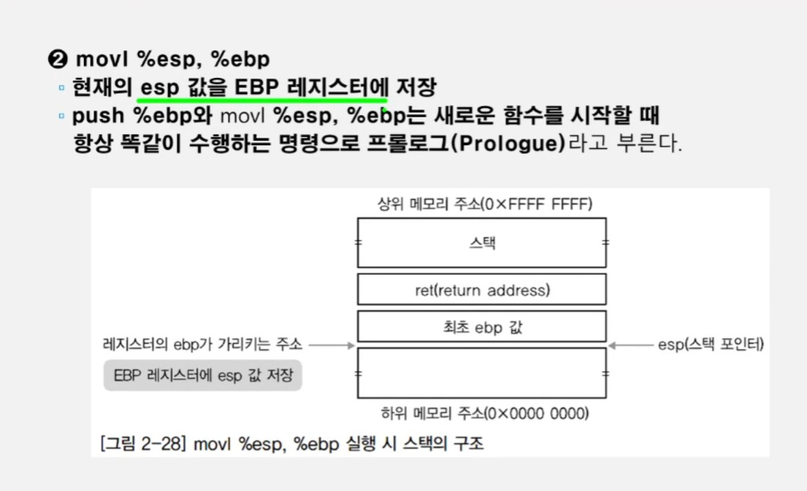
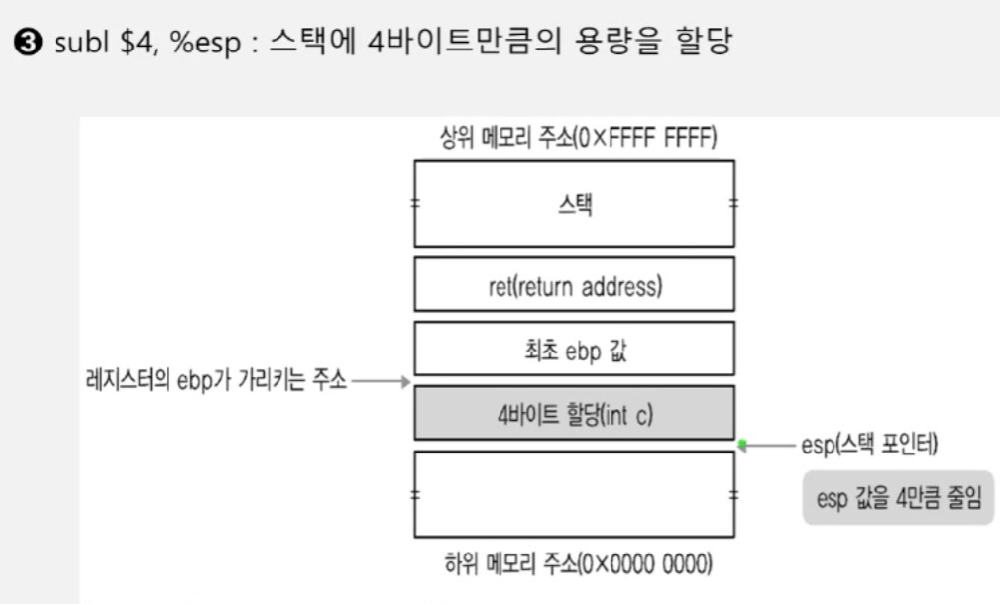
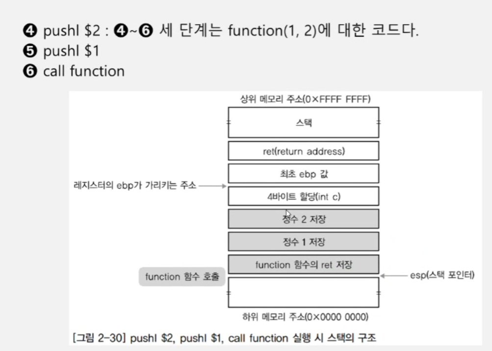
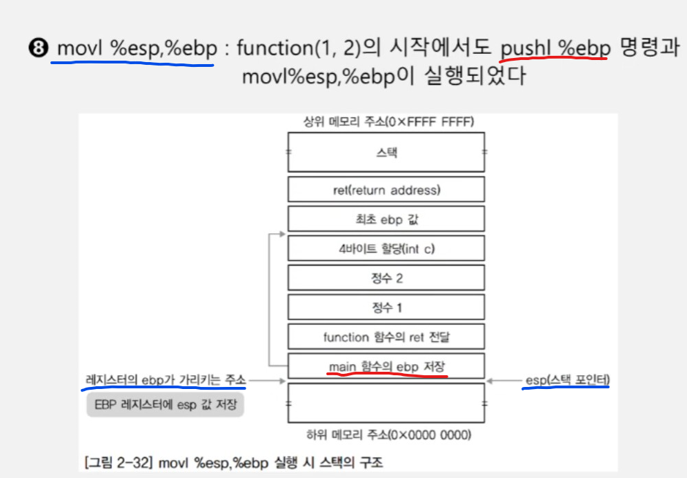
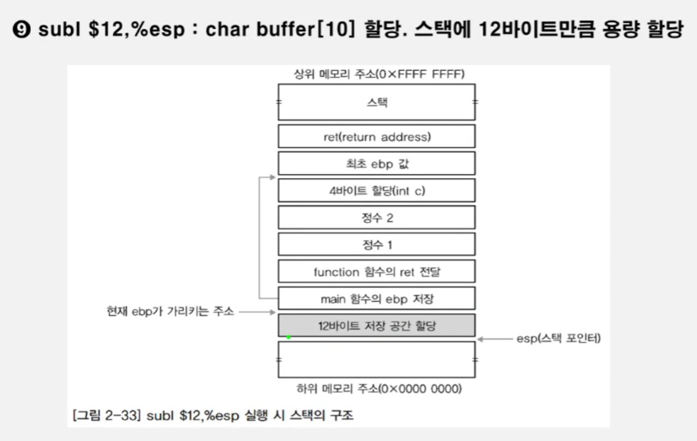
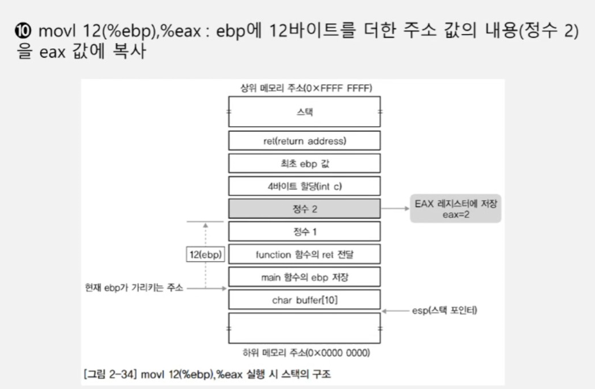
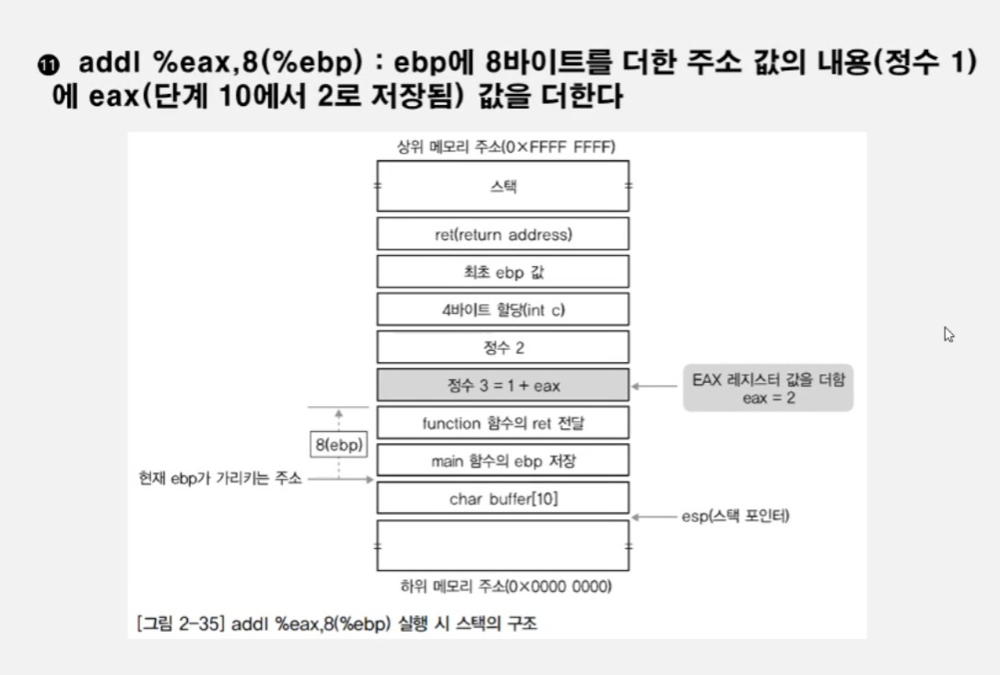

<!-- post 폴더 이름 -> 연관성을 찾지못함 ( 이상하게 바꿔도 정상적으로 작동했기때문 ) -->


## 1. 어셈블리어의 기본 코드 분석 ( 시험 )

### 1-1. pushl %ebp
```
간단히 생각해보자
```


<details>
<summary> 정답 </summary>
<div markdown="1">

```
ebp의 값만큼 push(공간확장)한다.
이 때 최초의 ebp값(최초의 프레임 포인터)을 SFP(Saved Frame Pointer)라고 하며,
저장되기 전에 ret 부터 저장이 된다.
```
- 이미지
    
</div>
</details>


### 1-2. movl %esp, %ebp
```
무슨 과정을 하는지 생각해보자
```

<details>
<summary> 정답 </summary>
<div markdown="1">

-   

</div>
</details>


### 1-3.subl $4 , #esp
```
왜 4의 값을 뺄까?
```


<details>
<summary> 정답 </summary>
<div markdown="1">

-   <br>
int c가 선언되어있고, 주소 값 아래로 가면 메모리의 용량이 학장된다.
</div>
</details>


### 1-4 push $2, push $1, call function
```
어떻게 될지 예측해보자.
```

<details>
<summary> 정답 </summary>
<div markdown="1">

-   

```
정수 2가 들어갈 공간, 정수 1이 들어갈만한 자리를 확보하고 function함수를 호출한다.
```
</div>
</details>


### 1-5. pushl %ebp, movl %esp %ebp
```
프롤로그 뿐만아니라 ?
```


<details>
<summary> 정답 </summary>
<div markdown="1">

-   
```
function(1, 2)에서도 프롤로그가 진행되었다는 것 !!
```
</div>
</details>


### 1-6. subl $12, %esp ( char buffer[10] 관련 )
```
esp에서 12를 빼서 12바이트의 메모리 용량을 할당했다.

char buffer[10]는 10바이트인데 왜 12바이트를 할당했을까?
```

<details>
<summary> 정답 </summary>
<div markdown="1">

-   
```
32비트에서 운용되고 있으니 char형 배열의 크기인 10바이트를 해주고 싶어도
기본 바이트가 4바이트씩 운용되고 있기 때문에
최소 크기인 12바이트의 메모리를 할당한 것
```
</div>
</details>


### 1-7. movl 12(%ebp), %eax


<details>
<summary> 정답 </summary>
<div markdown="1">

-   
```
ebp에서 12만큼 더한 주소값의 값을 eax 레지스터에 대입
(12만큼 더 했으니 스택상에서 아래로 가는게 아니라 위로 가는 것)
```
</div>
</details>


### 1-8. addl %eax, 8(%ebp)

<details>
<summary> 정답 </summary>
<div markdown="1">

-   
```
epb에서 eax레지스터에 있는 값을 ebp에서 8바이트만큼 더한 곳(정수 1 있는 곳)에 넣고 결과를 ebp에서 8바이트 있는 곳에 다시 대입한다
정수 1 -> 정수 3으로 바뀜
```
</div>
</details>