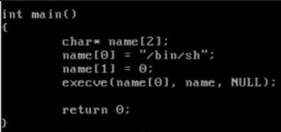

- 
- 위는 c언어로 작성된 코드이다. 이 코드를 어셈블리어로 변경하여 해석해보자 !

## 1. gdb를 사용한 어셈블리어
- 


### 1-1. push %epb  /   mov %esp, %ebp  /   sub $0x8, %esp
```
push %epb
mov %esp, %ebp
sub $0x8, %esp

여기까지 해석을 해보자.
그리고 왜 3번째 줄은 8을 빼야했을까?
```


<details>
<summary> 정답 </summary>
<div markdown="1">

-   
```
32비트에서 포인터 변수의 크기는 4바이트이기때문에
char형 포인터 변수의 배열 하나당 크기는 4바이트씩이다.
name의 길이가 2개이므로 4바이트 x 2 = 8바이트의 메모리를 할당한 것 !
```
</div>
</details>

### 1-2. movl $0x8071548, 0xfffffff8(%ebp)

```
어디에 무엇을 넣으려고 했을까?
```

<details>
<summary> 정답 </summary>
<div markdown="1">

- 
```
epb에서 8을 뺀 곳(배열의 첫번째 요소)에 0x8071548의 값(/bin/sh)을 넣어준다.
```
</div>
</details>


### 1-3. movl $0x0, 0xfffffffc(%ebp)
```
어디에 무엇을 넣으려 했을까?
```

<details>
<summary> 정답 </summary>
<div markdown="1">

- 
- 배열의 2번째인 name[1]에 0이란 값을 넣기 위함이다 !
</div>
</details>


### 1-4. 매개변수
- 
```
위와 같이 push와 mov, lea를 한 이유가 무엇일까?
그리고 mov와 lea의 차이는 무엇일까?
```

<details>
<summary> 정답 </summary>
<div markdown="1">

- 
```
execve의 함수의 매개변수는 3개이다.
const char* filename, char* const argv[], char* const envp[]
각각의 매개변수에 대입을 하기 위한 메모리 확보를 하고자 push를 3번 하였고,
먼저 lea를 한 이유는 배열의 주소값을 넣어주기 위해서이고,
mov를 한 것은 name[0]의 값을 위해서 쓰였다.
그리고 매개변수는 뒤부터 들어가기때문에 먼저 NULL부터 push된 것 !
```
</div>
</details>