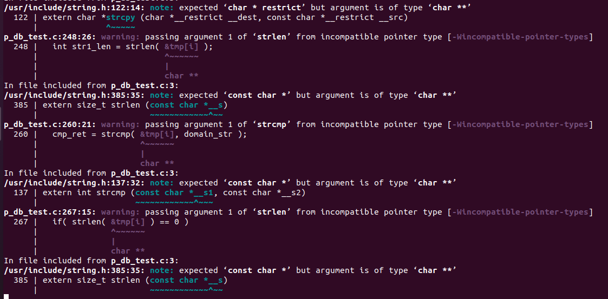

# 코드

<details>
<summary> <span style="color:yellow"> 코드 </span> </summary>
<div markdown="1">

```c
#include <stdio.h>
#include <pcap.h>
#include <string.h>
#include <stdlib.h>
#include <mysql.h>
#include <time.h>

// function()
MYSQL_RES* mysql_perform_query(MYSQL *connection, char *sql_query);
 
// PCAP
#define ETHER_ADDR_LEN 6

struct sniff_ethernet {
	u_char ether_dhost[ETHER_ADDR_LEN];
	u_char ether_shost[ETHER_ADDR_LEN];
	u_short ether_type;
};

struct sniff_ip {
	u_char ip_vhl;
	u_char ip_tos;
	u_short ip_len;
	u_short ip_id;
	u_short ip_off;

#define IP_RF 0x8000
#define IP_DF 0x4000
#define IP_MF 0x2000
#define IP_OFFMASK 0x1fff

	u_char ip_ttl;
	u_char ip_p;
	u_short ip_sum;
	
	struct in_addr ip_src, ip_dst;
};
#define IP_HL(ip)	(( (ip)->ip_vhl ) & 0x0f)
#define IP_V(ip)	(( (ip)->ip_vhl ) >> 4)


typedef u_int tcp_seq;
struct sniff_tcp {
	u_short th_dport;
	u_short th_sport;
	tcp_seq th_seq;
	tcp_seq th_ack;

	u_char th_offx2;
#define TH_OFF(tcp)	(( (tcp)->th_offx2 & 0xf0) >> 4 )
	u_char th_flags;

#define TH_FIN 0x01
#define TH_SYN 0x02 
#define TH_RST 0x04
#define TH_PUSH 0x08
#define TH_ACK 0x10
#define TH_URG 0x20
#define TH_ECE 0x40
#define TH_CRW 0x80
#define TH_FLAGS (TH_FIN|TH_SYN|TH_RST|TH_PUSH|TH_ACK|TH_URG|TH_ECE|TH_CRW)

	u_short th_win;
	u_short th_sum;
	u_short th_urp;
};


void got_packet(u_char *args, const struct pcap_pkthdr *header, const u_char* packet);

int main( int argc, char *argv[])
{

	char *dev, errbuf[PCAP_ERRBUF_SIZE];

	pcap_t *handle;

	bpf_u_int32 net;
	bpf_u_int32 mask;

	struct bpf_program fp;
	char filter_exp[] = "port 80";

	struct pcap_pkthdr header;
	const u_char *packet;


	dev = pcap_lookupdev(errbuf);
	if( dev == NULL ) {
		fprintf(stderr, "could not find default device %s \n", errbuf);
		return 2;
	}

	if( pcap_lookupnet(dev, &net, &mask, errbuf) == -1 ) {
		fprintf(stderr, "could not get netmask for device %s : %s \n", dev, errbuf);
		net = 0;
		mask = 0;
	}

	handle = pcap_open_live(dev, BUFSIZ, 1, 1000, errbuf);
	if( handle == NULL ) {
		fprintf(stderr, "could not open device %s : %s \n", dev, errbuf);
		return 2;
	}

	if( pcap_compile(handle, &fp, filter_exp, 0, net) == -1 ) {
		fprintf(stderr, "could not parse filter %s : %s \n", filter_exp, pcap_geterr(handle));
		return 2;
	}

	if( pcap_setfilter(handle, &fp) == -1 ) {
		fprintf(stderr, "could not install filter %s : %s \n", filter_exp, pcap_geterr(handle));
		return 2;
	}

	int result = 0;
	result = pcap_loop(handle, 0, got_packet, NULL);
	if( result != 0 ) {
		fprintf(stderr,"ERROR : pcap_loop() end with error !!! \n");
	} else {
		fprintf(stdout,"INFO : pcap_loop() end without error \n");
	}

	pcap_close(handle);

	return 0;
} // end of main() .

void got_packet(u_char *args, const struct pcap_pkthdr *header, const u_char* packet)
{
	#define SIZE_ETHERNET 14

	const struct sniff_ethernet *ethernet;
	const struct sniff_ip *ip;
	const struct sniff_tcp *tcp;
	const char *payload;

	u_int size_ip;
	u_int size_tcp;

	ethernet = (struct sniff_ethernet*)(packet);
	ip = (struct sniff_ip*)(packet + SIZE_ETHERNET);
	size_ip = IP_HL(ip) * 4;
	if( size_ip < 20 ) {
		fprintf(stderr, " * Invalid IP Header Length %u bytes \n", size_ip);
	}

	tcp = (struct sniff_tcp*)(packet + SIZE_ETHERNET + size_ip);
	size_tcp = TH_OFF(tcp) * 4;
	if( size_tcp < 20 ) {
		fprintf(stderr, " * Invalid TCP Header Length %u bytes \n", size_tcp);
	}

	payload = (u_char*)(packet + SIZE_ETHERNET + size_ip + size_tcp);

	unsigned short int payload_len = 0;
	payload_len = ntohs(ip->ip_len) - size_ip - size_tcp;

	// IP
	char *IPbuffer, *IPbuffer2;
	char IPbuffer_str[16];
	char IPbuffer2_str[16];

	IPbuffer = inet_ntoa(ip->ip_src);
	strcpy(IPbuffer_str, IPbuffer);

	IPbuffer2 = inet_ntoa(ip->ip_dst);
	strcpy(IPbuffer2_str, IPbuffer2);

	// port
	unsigned short tcp_src_port = 0;
	unsigned short tcp_dst_port = 0;

	tcp_src_port = ntohs(tcp->th_sport);
	tcp_dst_port = ntohs(tcp->th_dport);

	// domain
	u_char *domain = NULL;
	u_char *domain_end = NULL;
	u_char domain_str[256] = { 0x00};

	int domain_len = 0;

	domain = strstr(payload, "Host: ");
	if( domain != NULL ) {
		domain_end = strstr(domain, "\x0d\x0a");
		if( domain_end != NULL ) {
			domain_len = domain_end - domain - 6;
			strncpy(domain_str, domain + 6, domain_len );
//			printf("INFO: Domain : %s \n", domain_str);
		} else {
//			printf("INFO: Host string not found \n");
		}
	}


	
	// DB
	MYSQL_RES *res;
	MYSQL_ROW row;
	
    // New DB FOR compare with domain
	MYSQL_RES *res_block;
	MYSQL_ROW row_block;


	MYSQL* conn = mysql_init(NULL);
	if (conn == NULL) {
		printf("MySQL initialization failed");
		return;
	}
		
	// connect DB
	char* server = "localhost";
	char* user = "root";
	char* password = "1234";
	char* database = "project";
	
	if (mysql_real_connect(conn, server, user, password, database, 0, NULL, 0) == NULL) {
		printf("Unable to connect with MySQL server\n");
		mysql_close(conn);
		return;
	}


	if( domain_len ) {
		int cmp_ret = 1; // for compare result


		// NEW - Receive Block_list
		res_block = mysql_perform_query(conn, "SELECT * FROM Block_list");
		
		printf("\n");
		printf("Mysql Block_list \n");
		int i = 0, j = 0;
		char tmp[20][100] = {0x00};
		while( (row_block = mysql_fetch_row(res_block) ) != NULL){
			printf("Domain: %20s | ", row_block[0]);
			printf(" IP: %15s | ", row_block[1]);
			printf(" Port: %7s | \n", row_block[2]);
			strcpy( &tmp[j++][0], row_block[0]);
			// printf(" tmp : %d \n", strlen(&tmp[j++][0]));  // j++ coredump warning !!!
		}
		printf("\n");


		// start for loop 1 .
		for(int i = 0; i < 100; i++ ) {

		// if you knew str_len, you choice method like this
		int str1_len = strlen( &tmp[i][0] );
		// printf("why? %s . \n", &tmp[i][0] ); 
		// printf("str1_len : %d \n", str1_len);
		int str2_len = strlen( domain_str );
		// printf("domain : %s \n", domain_str);
		// printf("str2_len : %d \n", str2_len);

		if( str1_len != str2_len ) {
			continue; // move to next array !
		}
		
		printf("compare start \n");
		cmp_ret = strcmp( &tmp[i][0], domain_str );
		printf("DEBUG: domain name check result : %d \n", cmp_ret);

		if( cmp_ret == 0 )
			break; // stop for loop 1 .
		
		// break if meet NULL data in array .
		if( strlen( &tmp[0][i] ) == 0 ) 
			break; // stop for loop 1.
			

		} // end for loop 1 .


		// port
		printf("DATA: IP src : %s \n", IPbuffer_str);
		printf("DATA: IP dst : %s \n", IPbuffer2_str);

		printf("DATA : src Port %u \n", tcp_src_port);
		printf("DATA : dst Port %u \n", tcp_dst_port);
		
		// domain
		printf("INFO: Domain : %s . \n", domain_str);
		
		
		// for time check
		time_t t1;
		time(&t1);
		
		char* time_buf = ctime(&t1);
		time_buf[strlen(time_buf)-1] = '\0';
		printf("ctime의 결과 : %s\n", time_buf);
		
		char query[1024] = { 0x00};
		// query setting
		sprintf(query, "INSERT INTO Recent_list VALUES('%s', '%s', '%d', '%s')", domain_str, IPbuffer2_str, tcp_dst_port, time_buf);
		
		// mysql_perform_query(conn, query);
		if( mysql_query(conn, query) )
			printf("mysql_query Sucess \n");

		if( cmp_ret == 0 ) {
			printf("DEBUG: main blocked . \n");
		// sendraw(); // here is block packet function location later
		} else {
			printf("DEBUG: domain allowed . \n");
		} // end if emp_ret .

		res = mysql_perform_query(conn, "SELECT * FROM Recent_list");

		printf("\n");
		printf("Mysql contents in mysql Recent_list \n");
		while( (row = mysql_fetch_row(res) ) != NULL){
			printf("Domain: %20s | ", row[0]);
			printf(" IP: %15s | ", row[1]);
			printf(" Port: %7s | ", row[2]);
			printf(" Time: %s . \n", row[3]);
		}
		printf("\n");
		mysql_free_result(res);
		mysql_close(conn);

		} // end if domain_len
} // end of got_packet()

// query function() for print of DB contents
MYSQL_RES* mysql_perform_query(MYSQL *connection, char *sql_query) {
 
    if(mysql_query(connection, sql_query)) {
        printf("MYSQL query error : %s\n", mysql_error(connection));
        exit(1);
    }
    return mysql_use_result(connection);
}
```

</div>
</details>


<br>
<br>
<br>
<br>
<br>
<br>
<br>
<br>


# 코드 분석

```c
    // NEW - Receive Block_list
    res_block = mysql_perform_query(conn, "SELECT * FROM Block_list");
    
    printf("\n");
    printf("Mysql Block_list \n");
    int i = 0, j = 0;
    char tmp[20][100] = {0x00};
    while( (row_block = mysql_fetch_row(res_block) ) != NULL){
        printf("Domain: %20s | ", row_block[0]);
        printf(" IP: %15s | ", row_block[1]);
        printf(" Port: %7s | \n", row_block[2]);
        strcpy( &tmp[j++][0], row_block[0]);
        // printf(" tmp : %d \n", strlen(&tmp[j++][0]));  // j++ coredump warning !!!
    }
    printf("\n");
```
- <span style="color:yellow"> mysql_perform_query() </span>로 쿼리 실행한 결과를 받아온다. <br>
<span style="color:violet"> return </span>값은 <span style="color:yellow"> mysql_use_result() </span>함수를 사용하여 받아오게 된다. <br>
그 값을 <span style="color:#00FF00"> MYSQL_RES *</span><span style="color:#87CEEB">res_block </span>으로 반환시킨다. <br>
그렇게 반환 된 값들을 한 줄씩 불러오기 위해 <span style="color:yellow"> mysql_fetch_row() </span>함수를 사용하였고 <span style="color:#87CEEB"> row_block </span>변수에 저장된 값들을 tmp라는 2차원 배열에 저장하여 비교하는데 사용했다.


# 트러블 슈팅 및 피드백

## 1. 가장 난관이였던 <span style="color:#87CEEB"> row_block[0] </span>의 값을 새로운 변수에 담아서 비교하는데 사용하려고 했던 것

### 첫번째 시도
- <span style="color:yellow"> row_block[0]의 값을 비교를 위해 쓰일 문자열에 넣어서 출력 먼저 해보기 </span>
```c
char *temp = { 0x00};

int i = 0, j = 0;
while( (row_block = mysql_fetch_row(res_block) ) != NULL){
    printf("Domain: %20s | ", row_block[0]);
    printf(" IP: %15s | ", row_block[1]);
    printf(" Port: %7s | \n", row_block[2]);
    strcpy(temp, row_block[0]);
    printf("temp: %s \n", temp);
}
```
- 결과: temp에 도메인의 값이 저장이 잘 되어서 <span style="color:yellow"> `printf()` </span>로 출력이 가능했었다.
  

<br>
<br>
<br>
<br>

### 두번째 시도 <span style="color:#FF0000"> ( 실패 ) </span>

- <span style="color:yellow"> 다음 도메인의 값도 저장해야하니 배열에 저장해보기 </span>
```c
char *temp[50] = { 0x00};

int i = 0, j = 0;
while( (row_block = mysql_fetch_row(res_block) ) != NULL){
    printf("Domain: %20s | ", row_block[0]);
    printf(" IP: %15s | ", row_block[1]);
    printf(" Port: %7s | \n", row_block[2]);
    strcpy(temp[i], row_block[0]);
    printf("temp: %s \n", temp[i++]);
}
```
- <span style="color:#FF0000"> 결과: **Segmentation error ( core dump )** </span> 
- <span style="color:orange"> 원인: 서로의 자료형이 맞지 않는걸까?</span>
- <span style="color:#00FF00"> 피드백: row_block[0]의 값들을 인지 하지 못하여 MYSQL_ROW의 구조체를 찾아봐야했다. </span> 

- MYSQL_ROW 구조체
```c
typedef char** MYSQL_ROW
```
- <span style="color:#00FF00"> 더블 포인터를 사용하고 있었다는 걸 찾았다. </span>
  
<br>
<br>
<br>
<br>

### 세번째 시도 <span style="color:#FF0000"> ( 실패 ) </span>
- <span style="color:yellow"> 주소형태로 비교하는 것이 되지만 인덱스를 붙여 참조로 하는 것은 되지 않는 더블포인터형이라면 주소형태로 strcpy()를 실행해보자. </span>

```c
char *temp[50] = { 0x00};

int i = 0, j = 0;
while( (row_block = mysql_fetch_row(res_block) ) != NULL){
    printf("Domain: %20s | ", row_block[0]);
    printf(" IP: %15s | ", row_block[1]);
    printf(" Port: %7s | \n", row_block[2]);
    strcpy(&temp[i], row_block[0]);
    printf("temp: %s \n", &temp[i++]);
}
```
- <span style="color:#FF0000"> 결과: 오류가 뜨지는 않았지만, <span style="color:yellow"> Warning </span>이 뜨기 시작헀다. </span>

- <span style="color:yellow"> Warning </span> 내용
    
- 이것을 보고 자료형을 (char*)으로 모두 캐스팅 해주었고, 해결된 것 같았지만 비교할 때 문제가 생기기 시작했다.
- 문제는 <span style="color:yellow"> strlen() </span>함수의 값이 도메인의 문자열과 맞지 않는다는 것인데 이게 비교를 하는 <span style="color:#87CEEB"> cmp_ret </span>변수의 값을 제대로 받아올 수 없음을 초래했다.

- <span style="color:orange"> 원인: 애초에 오류가 안 났을 뿐이지 제대로 값을 가져오지 못한 듯 했다. 왜냐하면 temp라는 배열의 값을 하나하나 찍었을 때 도메인 여러 개가 아니라 한 개의 도메인을 한 글자씩 바라보고 있었기 떄문이었다. </span>
- <span style="color:#00FF00"> 피드백: 포인터 배열이 아닌, 2차원 배열을 사용하여 주소값들을 저장해보기로 했다. </span>


### 네번째 시도 <span style="color:#00FF00"> ( 성공 ) </span>
```c
    printf("\n");
    printf("Mysql Block_list \n");
    int i = 0, j = 0;
    char tmp[20][100] = {0x00};
    while( (row_block = mysql_fetch_row(res_block) ) != NULL){
        printf("Domain: %20s | ", row_block[0]);
        printf(" IP: %15s | ", row_block[1]);
        printf(" Port: %7s | \n", row_block[2]);
        strcpy( &tmp[j++][0], row_block[0]);
        // printf(" tmp : %d \n", strlen(&tmp[j++][0]));  // j++ coredump warning !!!
    }
    printf("\n");
```
- <span style="color:#FF0000"> 결과: </span> <span style="color:#00FF00"> 성공 !! </span>
- <span style="color:orange"> 원인: 주소값들을 2차원 배열의 각각 시작 주소에 저장함으로써 도메인의 주소값들을 저장 & 사용할 수 있었다 !</span>
- <span style="color:#00FF00"> 피드백: 주소값들을 사용하기 위한 포인터 배열은 왜 안 됐었던건지 이유를 찾아야한다. </span>


## 2. <span style="color:yellow"> mysql_send_query() </span> 사용방법 ( 내 트러블슈팅은 아니지만 같은 조원의 트러블 슈팅 중 하나 )

- <span style="color:#00FF00"> 공식 문서 </span> 내용을 잘 읽어보자.

<span style="font-size:150%"> <span style="color:violet"> 어떻게 사용하는지, 누구와 사용해야하는지, 매개변수는 어떤 것을 넣어줘야하는지 </span> </span>


- 아래는 공식 문서의 내용이다.
  
```c++
mysql_send_query() executes a SQL statement without waiting for the result. 
The main purpose of this function is to perform batch execution 
of DML statements.

Each successful call to mysql_send_query() 
must be followed by a call to mysql_read_query_result(). 
Multiple calls to mysql_send_query() can be made before the calls 
to mysql_read_query_result() are done.
```
- 이것을 보면 <span style="color:yellow"> mysql_send_qeury() </span>는 <span style="color:yellow"> mysql_read_query_result() </span>와 함께 사용함을 찾을 수 있다.
- <span style="color:#00FF00"> 공식문서 </span>에 답이 없다고 생각하기전에 답부터 찾아보는 <span style="color:violet"> 습관 </span> 을 들여야겠다.