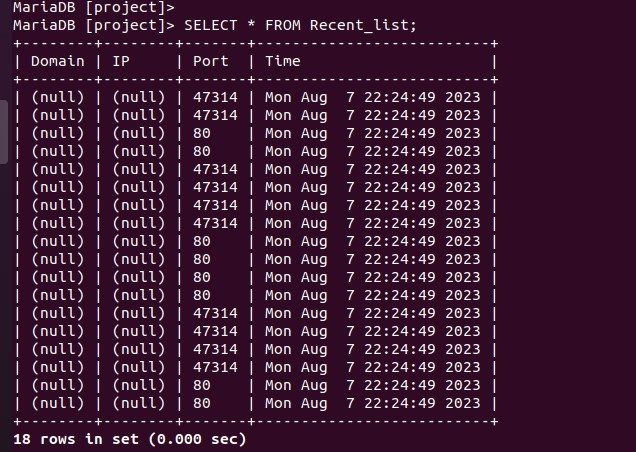

# 코드

<<<<<<< HEAD
<details>
<summary> <span style="color:yellow"> 코드 </span> </summary>
<div markdown="1">

=======
>>>>>>> 52eb7008d359a365241d32cab62c238423ab2b2c
```c
#include <stdio.h>
#include <pcap.h>
#include <string.h>
#include <stdlib.h>
#include <mysql.h>
#include <time.h>

// function()
MYSQL_RES* mysql_perform_query(MYSQL *connection, char *sql_query);

// DB
MYSQL_RES *res;
MYSQL_ROW row;

MYSQL_RES *res_block;
MYSQL_ROW row_block;

MYSQL* conn;

// connect DB
char* server = "localhost";
char* user = "root";
char* password = "1234";
char* database = "project";
	
	
	

// PCAP
#define ETHER_ADDR_LEN 6


struct sniff_ethernet {
	u_char ether_dhost[ETHER_ADDR_LEN];
	u_char ether_shost[ETHER_ADDR_LEN];
	u_short ether_type;
};

struct sniff_ip {
	u_char ip_vhl;
	u_char ip_tos;
	u_short ip_len;
	u_short ip_id;
	u_short ip_off;

#define IP_RF 0x8000
#define IP_DF 0x4000
#define IP_MF 0x2000
#define IP_OFFMASK 0x1fff

	u_char ip_ttl;
	u_char ip_p;
	u_short ip_sum;
	
	struct in_addr ip_src, ip_dst;
};
#define IP_HL(ip)	(( (ip)->ip_vhl ) & 0x0f)
#define IP_V(ip)	(( (ip)->ip_vhl ) >> 4)


typedef u_int tcp_seq;
struct sniff_tcp {
	u_short th_dport;
	u_short th_sport;
	tcp_seq th_seq;
	tcp_seq th_ack;

	u_char th_offx2;
#define TH_OFF(tcp)	(( (tcp)->th_offx2 & 0xf0) >> 4 )
	u_char th_flags;

#define TH_FIN 0x01
#define TH_SYN 0x02 
#define TH_RST 0x04
#define TH_PUSH 0x08
#define TH_ACK 0x10
#define TH_URG 0x20
#define TH_ECE 0x40
#define TH_CRW 0x80
#define TH_FLAGS (TH_FIN|TH_SYN|TH_RST|TH_PUSH|TH_ACK|TH_URG|TH_ECE|TH_CRW)

	u_short th_win;
	u_short th_sum;
	u_short th_urp;
};

void got_packet(u_char *args, const struct pcap_pkthdr *header, const u_char* packet);

// new
#define DOMAIN_BUF 256
#define IP_SIZE 16
#define IP_HDR_SIZE 20
#define TCP_HDR_SIZE 20
#define REC_DOM_MAX 20
#define REC_DOM_LEN 100
#define TMP_THUD 1024
#define TO_MS 1000

char* SELECT = "Recent_list";
int MODE = 0;
void print_packet_ethernet(struct sniff_ethernet* ethernet, unsigned short int payload_len, const struct pcap_pkthdr *header);
char* print_packet_ip(struct sniff_ip* ip);
unsigned short int  print_packet_tcp(struct sniff_tcp* tcp);
u_char* print_packet_domain(const char *payload);
void print_block_list(char tmp[REC_DOM_MAX][REC_DOM_LEN]);
char* now_time();
void mysql_insert(char* recv_ip, unsigned short int recv_tcp, u_char* recv_domain);
void mysql_select(char* SELECT_TB);

int main( int argc, char *argv[])
{

	char *dev, errbuf[PCAP_ERRBUF_SIZE];

	pcap_t *handle;

	bpf_u_int32 net;
	bpf_u_int32 mask;

	struct bpf_program fp;
	char filter_exp[] = "port 80";

	struct pcap_pkthdr header;
	const u_char *packet;


	dev = pcap_lookupdev(errbuf);
	if( dev == NULL ) {
		fprintf(stderr, "could not find default device %s \n", errbuf);
		return 2;
	}

	if( pcap_lookupnet(dev, &net, &mask, errbuf) == -1 ) {
		fprintf(stderr, "could not get netmask for device %s : %s \n", dev, errbuf);
		net = 0;
		mask = 0;
	}

	handle = pcap_open_live(dev, BUFSIZ, 1, TO_MS, errbuf); // TO_MS 1000
	if( handle == NULL ) {
		fprintf(stderr, "could not open device %s : %s \n", dev, errbuf);
		return 2;
	}

	if( pcap_compile(handle, &fp, filter_exp, 0, net) == -1 ) {
		fprintf(stderr, "could not parse filter %s : %s \n", filter_exp, pcap_geterr(handle));
		return 2;
	}

	if( pcap_setfilter(handle, &fp) == -1 ) {
		fprintf(stderr, "could not install filter %s : %s \n", filter_exp, pcap_geterr(handle));
		return 2;
	}

	// DB Connection
	
	conn = mysql_init(NULL);
	if (conn == NULL) {
		fprintf(stderr,"MySQL initialization failed");
		return 2;
	}
	if (mysql_real_connect(conn, server, user, password, database, 0, NULL, 0) == NULL) {
		fprintf(stderr,"mysql_real_connect() Unable to connect with MySQL server !");
		mysql_close(conn);
		return 2;
	}


	int result = 0;
	result = pcap_loop(handle, 0, got_packet, NULL);
	if( result != 0 ) {
		fprintf(stderr,"ERROR : pcap_loop() end with error !!! \n");
	} else {
		fprintf(stdout,"INFO : pcap_loop() end without error \n");
	}

	pcap_close(handle);
	mysql_close(conn);

	return 0;
} // end of main() .

void got_packet(u_char *args, const struct pcap_pkthdr *header, const u_char* packet)
{
	#define SIZE_ETHERNET 14

	struct sniff_ethernet *ethernet;
	struct sniff_ip *ip;
	struct sniff_tcp *tcp;
	char *payload;
	
	char* recv_ip;
    unsigned short int recv_tcp;
    u_char* recv_domain;
	
	u_int size_ip;
	u_int size_tcp;

	ethernet = (struct sniff_ethernet*)(packet);
	ip = (struct sniff_ip*)(packet + SIZE_ETHERNET);
	size_ip = IP_HL(ip) * 4;
	if( size_ip < IP_HDR_SIZE ) { // IP_HDR_SIZE == 20
		fprintf(stderr, " * Invalid IP Header Length %u bytes \n", size_ip);
	}

	tcp = (struct sniff_tcp*)(packet + SIZE_ETHERNET + size_ip);
	size_tcp = TH_OFF(tcp) * 4;
	if( size_tcp < TCP_HDR_SIZE ) { // TCP_HDR_SIZE == 20
		fprintf(stderr, " * Invalid TCP Header Length %u bytes \n", size_tcp);
	}

	payload = (u_char*)(packet + SIZE_ETHERNET + size_ip + size_tcp);

	unsigned short int payload_len = 0;
	payload_len = ntohs(ip->ip_len) - size_ip - size_tcp;
	
	
	// print domain
	// if blocked domain, don't print ip, port ->> define
	recv_domain = print_packet_domain(payload);
	// print ethernet
	print_packet_ethernet(ethernet, payload_len, header);
	// print ip
	recv_ip = print_packet_ip(ip);
	
	// print port
	recv_tcp = print_packet_tcp(tcp);

	
	if(recv_domain && recv_ip && recv_tcp) {
		// query insert in Recent_list
		mysql_insert(recv_ip, recv_tcp, recv_domain);
		
		// select * from recent_list
		mysql_select(SELECT);
	}
} // end of got_packet()

// query function() for print of DB contents
MYSQL_RES* mysql_perform_query(MYSQL *connection, char *sql_query) {
 
    if(mysql_query(connection, sql_query)) {
        printf("MYSQL query error : %s\n", mysql_error(connection));
        exit(1);
    }
    return mysql_use_result(connection);
}

void print_packet_ethernet(struct sniff_ethernet* ethernet, unsigned short int payload_len, const struct pcap_pkthdr *header) {
	
	if( MODE == 1 ) {
		printf("DATA: payload_len %u \n", payload_len);
		
		printf("Jacked a packet with Length of [%d] \n", header->len);
		
		printf("DATA: dest MAC : %02x:%02x:%02x:%02x:%02x:%02x\n",
				ethernet->ether_dhost[0],
				ethernet->ether_dhost[1],
				ethernet->ether_dhost[2],
				ethernet->ether_dhost[3],
				ethernet->ether_dhost[4],
				ethernet->ether_dhost[5]
				);
		
		printf("DATA: src MAC : %02x:%02x:%02x:%02x:%02x:%02x\n",
				ethernet->ether_shost[0],
				ethernet->ether_shost[1],
				ethernet->ether_shost[2],
				ethernet->ether_shost[3],
				ethernet->ether_shost[4],
				ethernet->ether_shost[5]
				);
	}
}


char* print_packet_ip(struct sniff_ip* ip) {
	
	// IP
	char *IPbuffer, *IPbuffer2;
	char IPbuffer_str[IP_SIZE]; 		// IP_SIZE 16
	static char IPbuffer2_str[IP_SIZE];	// IP_SIZE 16

	IPbuffer = inet_ntoa(ip->ip_src);
	strcpy(IPbuffer_str, IPbuffer);

	IPbuffer2 = inet_ntoa(ip->ip_dst);
	strcpy(IPbuffer2_str, IPbuffer2);
	
	if ( MODE == 1 ) {
		printf("DATA: IP src : %s \n", IPbuffer_str);
		printf("DATA: IP dst : %s \n", IPbuffer2_str);
	}
	return IPbuffer2_str;
}   

unsigned short print_packet_tcp(struct sniff_tcp* tcp) {
	// port
	unsigned short tcp_src_port = 0;
	unsigned short tcp_dst_port = 0;

	tcp_src_port = ntohs(tcp->th_sport);
	tcp_dst_port = ntohs(tcp->th_dport);
	
	if ( MODE == 1 ) {
		printf("DATA : src Port %u \n", tcp_src_port);
		printf("DATA : dst Port %u \n", tcp_dst_port);
	}
	
	return tcp_dst_port;
}

u_char* print_packet_domain(const char *payload) {
	
	// domain
	u_char *domain = NULL;
	u_char *domain_end = NULL;
	static u_char domain_str[DOMAIN_BUF] = { 0x00}; // DOMAIN_BUF 256

	int domain_len = 0;

	domain = strstr(payload, "Host: ");
	if( domain != NULL ) {
		domain_end = strstr(domain, "\x0d\x0a");
		if( domain_end != NULL ) {
			domain_len = domain_end - domain - 6;
			strncpy(domain_str, domain + 6, domain_len );
//			printf("INFO: Domain : %s \n", domain_str);
		} else {
//			printf("INFO: Host string not found \n");
		}
	}


	// New DB FOR compare with domain
	
	if( domain_len ) {
		int cmp_ret = 1; // for compare result

		char tmp[REC_DOM_MAX][REC_DOM_LEN] = {0x00};
		// print block_list
		print_block_list(tmp);
		
		// start for loop 1 .
		for(int i = 0; i < 100; i++ ) {

		// if you knew str_len, you choice method like this
		int str1_len = strlen( &tmp[i][0] );
		int str2_len = strlen( domain_str );
		
		// printf("why? %s . \n", &tmp[i][0] ); 
		// printf("str1_len : %d \n", str1_len);
		// printf("domain : %s \n", domain_str);
		// printf("str2_len : %d \n", str2_len);

		if( str1_len != str2_len ) {
			continue; // move to next array !
		}
		
		
		// printf("compare start \n");
		cmp_ret = strcmp( &tmp[i][0], domain_str );
		// if each other string is same length but not same string, so break
		if( cmp_ret < 0 ) break; 
		printf("DEBUG: domain name check result : %d \n", cmp_ret);

		if( cmp_ret == 0 )
			break; // stop for loop 1 .
		
		// break if meet NULL data in array .
		if( strlen( &tmp[0][i] ) == 0 ) 
			break; // stop for loop 1.

		} // end for loop .

		// domain
		printf("INFO: Domain : %s . \n", domain_str);
		
		if( cmp_ret == 0 ) {
			printf("DEBUG: main blocked . \n");
		// sendraw(); // here is block packet function location later
		} else {
			printf("DEBUG: domain allowed . \n");
		} // end if emp_ret .
		
		MODE = 1;
		return domain_str;
	} else {
		MODE = 0;
	}
	
	
}

void print_block_list(char tmp[REC_DOM_MAX][REC_DOM_LEN]) {
		// Receive Block_list
		res_block = mysql_perform_query(conn, "SELECT * FROM Block_list");
		
		printf("\n");
		printf("Mysql Block_list \n");
		int i = 0, j = 0;
		
		while( (row_block = mysql_fetch_row(res_block) ) != NULL) {
			printf("Domain: %20s | ", row_block[0]);
			printf(" IP: %15s | ", row_block[1]);
			printf(" Port: %7s | \n", row_block[2]);
			strcpy( &tmp[j++][0], row_block[0]);
			// printf("&tmp[j++][0] = %s", &tmp[j++][0]); // j++ coredump warning !!!
			// printf(" tmp : %d \n", strlen(&tmp[j++][0]));  // j++ coredump warning !!!
		}
		printf("\n");
		
		mysql_free_result(res_block);
}

char* now_time(){
	// for time check
	time_t t1;
	time(&t1);
	
	char* time_buf = ctime(&t1);
	time_buf[strlen(time_buf)-1] = '\0';
	// printf("ctime의 결과 : %s\n", time_buf);
	
	return time_buf;
}


void mysql_insert(char* recv_ip, unsigned short int recv_tcp, u_char* recv_domain)
{
	// print time
	char* time_buf = now_time();
	// printf("ctime의 결과 : %s\n", time_buf);
	
	// INSERT
	char query[TMP_THUD] = { 0x00};
	// query setting
	sprintf(query, "INSERT INTO Recent_list VALUES('%s', '%s', '%d', '%s')", recv_domain, recv_ip, recv_tcp, time_buf);
	
	if( mysql_query(conn, query) )
		printf("mysql_query Sucess \n");
}


void mysql_select(char* SELECT)
{
	char query[TMP_THUD] = { 0x00 } ;
	sprintf(query, "SELECT * FROM %s", SELECT);
	
	res = mysql_perform_query(conn, query);

	printf("\n");
	printf("Mysql contents in mysql %s \n", SELECT);
	while( (row = mysql_fetch_row(res) ) != NULL){
		printf("Domain: %20s | ", row[0]);
		printf(" IP: %15s | ", row[1]);
		printf(" Port: %7s | ", row[2]);
		printf(" Time: %s . \n", row[3]);
	}
	printf("\n");
	mysql_free_result(res);
	
}
```

<<<<<<< HEAD
</div>
</details>

=======
>>>>>>> 52eb7008d359a365241d32cab62c238423ab2b2c


<br>
<br>
<br>
<br>
<br>
<br>
<br>
<br>


# 코드 분석


- <span style="font-size:150%"> <span style="color:yellow"> 새로 추가된 부분 요약 </span> </span>

```c
#define DOMAIN_BUF 256
#define IP_SIZE 16
#define IP_HDR_SIZE 20
#define TCP_HDR_SIZE 20
#define REC_DOM_MAX 20
#define REC_DOM_LEN 100
#define TMP_THUD 1024
#define TO_MS 1000

char* SELECT = "Recent_list";
int MODE = 0;
void print_packet_ethernet(struct sniff_ethernet* ethernet, unsigned short int payload_len, const struct pcap_pkthdr *header);
char* print_packet_ip(struct sniff_ip* ip);
unsigned short int  print_packet_tcp(struct sniff_tcp* tcp);
u_char* print_packet_domain(const char *payload);
void print_block_list(char tmp[REC_DOM_MAX][REC_DOM_LEN]);
char* now_time();
void mysql_insert(char* recv_ip, unsigned short int recv_tcp, u_char* recv_domain);
void mysql_select(char* SELECT_TB);
```

## 1. void print_packet_ethernet(struct sniff_ethernet* ethernet, unsigned short int payload_len, const struct pcap_pkthdr *header);

```c
void print_packet_ethernet(struct sniff_ethernet* ethernet, unsigned short int payload_len, const struct pcap_pkthdr *header) {
	
	if( MODE == 1 ) {
		printf("DATA: payload_len %u \n", payload_len);
		
		printf("Jacked a packet with Length of [%d] \n", header->len);
		
		printf("DATA: dest MAC : %02x:%02x:%02x:%02x:%02x:%02x\n",
				ethernet->ether_dhost[0],
				ethernet->ether_dhost[1],
				ethernet->ether_dhost[2],
				ethernet->ether_dhost[3],
				ethernet->ether_dhost[4],
				ethernet->ether_dhost[5]
				);
		
		printf("DATA: src MAC : %02x:%02x:%02x:%02x:%02x:%02x\n",
				ethernet->ether_shost[0],
				ethernet->ether_shost[1],
				ethernet->ether_shost[2],
				ethernet->ether_shost[3],
				ethernet->ether_shost[4],
				ethernet->ether_shost[5]
				);
	}
}
```

- 특이사항은 <span style="color:violet"> MODE </span> 라는 <span style="color:orange"> define </span> 으로 정의된 변수가 1일 때만 출력을 한다는 것이다.
- <span style="color:violet"> MODE </span>가 1이면 <span style="color:#00FF00"> Payload </span> 에서 <span style="color:#00FF00"> Domain_len </span> 가 존재한다는 뜻이다.


- 밑의 2개의 새로 정의된 함수도 특이사항이 <span style="color:violet"> MODE </span>뿐이다.
  1. <span style="color:#3399FF"> char*</span> <span style="color:yellow"> print_packet_ip(<span style="color:#00FF00"> struct sniff_ip* </span> <span style="color:#87CEEB"> ip </span>) </span>; -> <span style="font-size:150%"> <span style="color:#00FF00"> [피드백 1개 존재 !!](#2-문자열의-return) </span> </span>
  2. <span style="color:#3399FF"> unsigned short int </span>  <span style="color:yellow"> print_packet_tcp(<span style="color:#00FF00"> struct sniff_tcp* </span> <span style="color:#87CEEB"> tcp </span>) </span>;


## 2. u_char* print_packet_domain(const char *payload);

```c
u_char* print_packet_domain(const char *payload) {
	
	// domain
	u_char *domain = NULL;
	u_char *domain_end = NULL;
	static u_char domain_str[DOMAIN_BUF] = { 0x00}; // DOMAIN_BUF 256

	int domain_len = 0;

	domain = strstr(payload, "Host: ");
	if( domain != NULL ) {
		domain_end = strstr(domain, "\x0d\x0a");
		if( domain_end != NULL ) {
			domain_len = domain_end - domain - 6;
			strncpy(domain_str, domain + 6, domain_len );
//			printf("INFO: Domain : %s \n", domain_str);
		} else {
//			printf("INFO: Host string not found \n");
		}
	}


	// New DB FOR compare with domain
	
	if( domain_len ) {
		int cmp_ret = 1; // for compare result

		char tmp[REC_DOM_MAX][REC_DOM_LEN] = {0x00};
		// print block_list
		print_block_list(tmp);
		
		// start for loop 1 .
		for(int i = 0; i < 100; i++ ) {

		// if you knew str_len, you choice method like this
		int str1_len = strlen( &tmp[i][0] );
		int str2_len = strlen( domain_str );
		
		// printf("why? %s . \n", &tmp[i][0] ); 
		// printf("str1_len : %d \n", str1_len);
		// printf("domain : %s \n", domain_str);
		// printf("str2_len : %d \n", str2_len);

		if( str1_len != str2_len ) {
			continue; // move to next array !
		}
		
		
		// printf("compare start \n");
		cmp_ret = strcmp( &tmp[i][0], domain_str );
		// if each other string is same length but not same string, so break
		if( cmp_ret < 0 ) break; 
		printf("DEBUG: domain name check result : %d \n", cmp_ret);

		if( cmp_ret == 0 )
			break; // stop for loop 1 .
		
		// break if meet NULL data in array .
		if( strlen( &tmp[0][i] ) == 0 ) 
			break; // stop for loop 1.

		} // end for loop .

		// domain
		printf("INFO: Domain : %s . \n", domain_str);
		
		if( cmp_ret == 0 ) {
			printf("DEBUG: main blocked . \n");
		// sendraw(); // here is block packet function location later
		} else {
			printf("DEBUG: domain allowed . \n");
		} // end if emp_ret .
		
		MODE = 1;
		return domain_str;
	} else {
		MODE = 0;
	}
	
} // end of print_packet_domain
```

- <span style="color:yellow"> print_packet_domain() </span>의 특징도 <span style="color:violet"> MODE </span>를 <span style="color:#87CEEB"> domain_len </span>의 값이 존재할 때 1 아닐 때 0으로 해준다는 것이 특징이다.
- <span style="font-size:150%"> <span style="color:#00FF00"> [피드백 2개 존재 !!](#트러블-슈팅-및-피드백) </span> </span>

## 3. void print_block_list(char tmp[REC_DOM_MAX][REC_DOM_LEN]);

```c
void print_block_list(char tmp[REC_DOM_MAX][REC_DOM_LEN]) {
		// Receive Block_list
		res_block = mysql_perform_query(conn, "SELECT * FROM Block_list");
		
		printf("\n");
		printf("Mysql Block_list \n");
		int i = 0, j = 0;
		
		while( (row_block = mysql_fetch_row(res_block) ) != NULL) {
			printf("Domain: %20s | ", row_block[0]);
			printf(" IP: %15s | ", row_block[1]);
			printf(" Port: %7s | \n", row_block[2]);
			strcpy( &tmp[j++][0], row_block[0]);
			// printf("&tmp[j++][0] = %s", &tmp[j++][0]); // j++ coredump warning !!!
			// printf(" tmp : %d \n", strlen(&tmp[j++][0]));  // j++ coredump warning !!!
		}
		printf("\n");
		
		mysql_free_result(res_block);
} // end of print_block_list() .
```

- 기존과 다른 점은 매개변수를 2차원 배열인 tmp로 받고 call by reference 형태로 사용한다는 것 뿐이다 !


## 4. void mysql_insert(char* recv_ip, unsigned short int recv_tcp, u_char* recv_domain);
```c
void mysql_insert(char* recv_ip, unsigned short int recv_tcp, u_char* recv_domain)
{
	// print time
	char* time_buf = now_time();
	// printf("ctime의 결과 : %s\n", time_buf);
	
	// INSERT
	char query[TMP_THUD] = { 0x00};
	// query setting
	sprintf(query, "INSERT INTO Recent_list VALUES('%s', '%s', '%d', '%s')", recv_domain, recv_ip, recv_tcp, time_buf);
	
	if( mysql_query(conn, query) )
		printf("mysql_query Sucess \n");
} // end of mysql_insert() .
```

- 특이점은 안에서 <span style="color:yellow"> now_time() </span>를 사용한다는 것외에는 전과 동일하게 사용한다. ( 여기 이외에 곳에서는 필요가 없다. )


## 5. void mysql_select(char* SELECT);

```c
void mysql_select(char* SELECT)
{
	char query[TMP_THUD] = { 0x00 } ;
	sprintf(query, "SELECT * FROM %s", SELECT);
	
	res = mysql_perform_query(conn, query);

	printf("\n");
	printf("Mysql contents in mysql %s \n", SELECT);
	while( (row = mysql_fetch_row(res) ) != NULL){
		printf("Domain: %20s | ", row[0]);
		printf(" IP: %15s | ", row[1]);
		printf(" Port: %7s | ", row[2]);
		printf(" Time: %s . \n", row[3]);
	}
	printf("\n");
	mysql_free_result(res);
} // end of mysql_select() .
```

- 전과 다른 점은 <span style="color:orange"> SELECT </span> 라는 전역변수로 DB안의 테이블을 보다 편하게 바꿀 수 있다는 점이다.


# 트러블 슈팅 및 피드백


## 1. 어떤 링크를 넣던간에 main_block을 하게 됨
도메인을 비교하고 있는데 갑자기 tmp 배열에 입력한 도메인의 값이 들어가서
block_list와 비교하는 cmp_ret의 값이 결국 같다고 나오게 되어,


### 첫번째 시도 <span style="color:#FF0000"> ( 실패 ) </span>
- 원인을 <span style="color:yellow"> str_cpy() </span>에 있다고 생각했는데
함수를 사용하는 <span style="color:orange"> block_list </span> 에는 <span style="color:#3399FF"> naver.com </span> 링크가 없다..

### 두번째 시도 <span style="color:#00FF00"> ( 성공 ) </span>

```c
printf("why? %s . \n", &tmp[i][0] ); 
printf("str1_len : %d \n", str1_len);
printf("domain : %s \n", domain_str);
printf("str2_len : %d \n", str2_len);
```

- 원인을 알아보기 위해 위의 코드를 사용하여 어디가 문제인지 확인해봤다.
- <span style="color:#FF0000"> 결과:  </span> naver.com 도메인과 kakao.com 라는 도메인처럼 서로의 길이가 같을 때 오류가 나는 것을 확인할 수 있었다.
- <span style="color:#00FF00"> 피드백:  </span> <span style="color:yellow"> strcmp() </span>함수는 반환값이 성공했을 때 0이고, 실패했을 때는 0이 아닌 값이 나오는데 <br>
실패를 하고 나서 계속 값을 비교하기 때문에 <span style="color:yellow"> strcmp() </span>함수의 반환값을 저장하는 <br>
 <span style="color:#87CEEB"> cmp_ret </span> <u>변수의 값이 0이 아닐 때</u> <span style="color:violet"> break; </span> 해주어서 해결했다 !


## 2. 문자열의 return
문자열을 줘야하는데 return 으로 주는게 안돼서..
사진처럼 나왔다.

-  


### 첫번째 시도 <span style="color:#00FF00"> ( 성공 ) </span>

- <span style="color:orange"> 원인: </span> <span style="color:violet"> return </span> 에 문자열. 즉, 문자열의 첫번째를 가리키는 주소값을 주었을 때 함수가 끝나면 <span style="color:violet"> return </span> 이 가리키던 주소값의 값들도 모두 사라졌다.

- <span style="color:#00FF00"> 피드백: </span> 함수가 끝이나도 값이 사라지지 않게 하기위해 <span style="color:#3399FF"> static </span> 을 붙여주었다 ! 