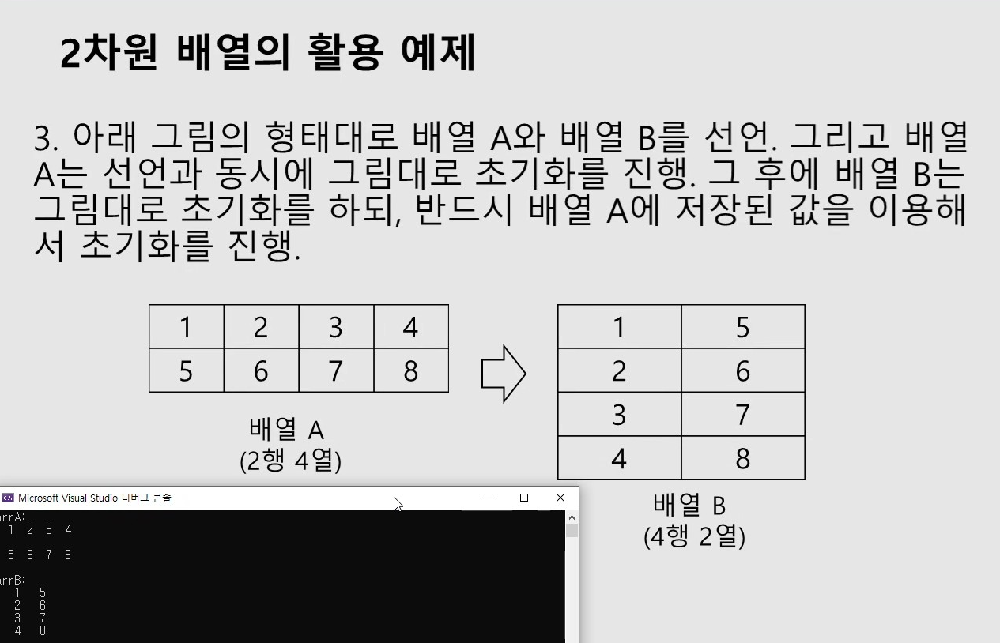
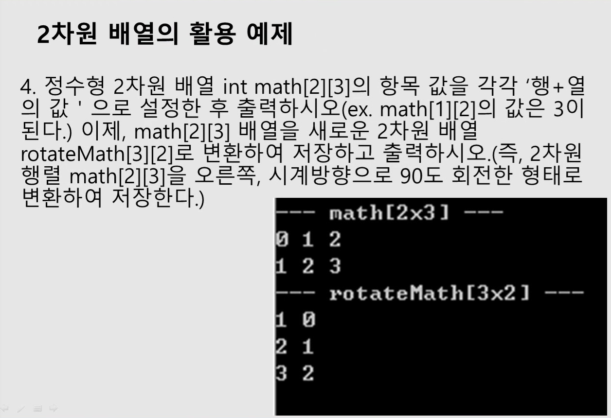

## 1. 오름차순 정렬 함수 정의
```
int main()
{
    int arr[4] = { 3,2,4,1 };
        int i, len;
        len = sizeof(arr) / sizeof(int);

        sort(arr, len);
        for (i = 0; i < len; i++)
            printf("%d ", arr[i]);

    return 0;   
}

조건 : sort함수를 오름차순으로 정렬하는 함수로 정의
```

<details>
<summary> 정답 </summary>
<div markdown="1">
<script src="https://gist.github.com/whalebee/c8506a4925b942cc7a03a676cd6d1de8.js"></script>
</div>
</details>


## 2. 내림차순 정렬 함수 정의
```
int main()
{
    int arr[7];
	int i, len;
	len = sizeof(arr) / sizeof(int);

	for (i = 0; i < len; i++)
	{
		printf("%d번째 입력 : ", i + 1);
		scanf_s("%d", &arr[i]);
	}

	DesSort(arr, len);

	for (i = 0; i < len; i++)
		printf("%d ", arr[i]);
    return 0;   
}

조건 : DesSort 내림차순으로 정렬하는 함수로 정의
```

<details>
<summary> 정답 </summary>
<div markdown="1">
<script src="https://gist.github.com/whalebee/2b459655442e644054b7cbffee92af96.js"></script>
</div>
</details>


## 3. villa ( 2차원 배열, keyword: 수작업 )
```
#include <stdio.h>


int main()
{
	int villa[4][2];
	int i, j, popu = 0;
	// 길이는 걍 상수로 써 잠시동안만
	/*
	땡 층 땡호 인구수 출력
	땡 층 땡 호 인구수 입력

	그리고 각 층의 인구수 출력
	*/

	// 입력
	

	// 출력
	

	return 0;
}

목적 : 입력과 출력 부분을 작성 !
```

<details>
<summary> 정답 </summary>
<div markdown="1">
<script src="https://gist.github.com/whalebee/1c9ada13f092b9f884a5049d1af81884.js"></script>
</div>
</details>


## 4. 행번호와 열번호 더하기
```
#include <stdio.h>

int main()
{
	/* 연습문제
	정수형 데이터를 저장하는 2차원 배열 degree[4][4]를 선언
	각 항목 값을 행 번호 + 열 번호의 값으로 설정하고,
	전체 배열 항목의 합계와 평균값을 출력
	*/
	int degree[4][4];
	int i, j, sum = 0;

	// 입력


	// 출력


	return 0;
}
```

<details>
<summary> 정답 </summary>
<div markdown="1">
<script src="https://gist.github.com/whalebee/7ff5e051c1928a7ea2757018e3681874.js"></script>
</div>
</details>


## 5. 구구단 2차열 배열에 저장하기
```
#include <stdio.h>

int main()
{
	/* 연습문제
	가로의 길이가 9, 세로의 길이가 3인 int형 2차원 배열 선언하고
	구구단 중에 2,3,4단을 저장해라

	확인하기 위한 출력
	*/

	int gugudan[3][9];
	int i, j;

    // 입력


    // 출력


	return 0;
}
```


<details>
<summary> 정답 </summary>
<div markdown="1">
<script src="https://gist.github.com/whalebee/8eaaac57b1f1010b0a9ce1290a92fdb4.js"></script>
</div>
</details>


## 6. 2차원 배열의 행열 관계
```
#include <stdio.h>

int main()
{
	/*
	배열 A와 배열 B 선언
	배열 A는 선언과 동시에 그림대로 초기화
	그 후에 배열 B는 그림대로 초기화를 하되, 반드시 !!
	배열 A에 저장된 값을 이용해서 초기화 진행.
	*/

	int arrA[2][4] = { 1,2,3,4,5,6,7,8 };
	int arrB[4][2];
	int i, j;


	return 0;
}
```
-  

<details>
<summary> 정답 </summary>
<div markdown="1">
<script src="https://gist.github.com/whalebee/e27eb4489200d7861465dc6818319dc8.js"></script>
</div>
</details>


## 7. rotateMath 정의
```
#include <stdio.h>

int main()
{
	/*
	정수형 2차원 배열 int math[2][3]의 항목 값을 각각
	행+열의 값으로 설정한 후에 출력 -> math[1][2]의 값은 3
	math[2][3] 배열을 새로운 2차원 배열 rotateMath[3][2]로 변환하여,
	저장하고 출력

	즉, 2차원 행렬 math[2][3]을 오른쪽, 시게방향으로 회전한 형태로 변환하여 저장

	for문 덩어리는 총 2개로 !! ( 기본은 3개가 맞음 )


    hint: index로 바꿔서 ( , ) 스케치하기, villa처럼 수동으로 해보기
	*/

	int math[2][3];
	int rotateMath[3][2];
	int i, j;

	return 0;
}
```
-   


<details>
<summary> 정답 </summary>
<div markdown="1">
<script src="https://gist.github.com/whalebee/684374449da00aefdd7f21636c131874.js"></script>
</div>
</details>