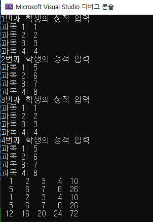

## 1. 과목과 총점구하기 ( 전역 변수 )
```
#include <stdio.h>

int record[5][5];
void writeRecord();
void writeSumRecord();
void showAllRecord();

int main()
{
	writeRecord();		// 입력
	writeSumRecord();	// 총점 구하는 함수 ( 9칸 )
	showAllRecord();	// 값을 보여줌

	return 0;
}
조건 : main은 어떤 것도 건드려서는 안 된다 !
```

-  


<details>
<summary> 정답 </summary>
<div markdown="1">
<script src="https://gist.github.com/whalebee/178b2bd7b18972c3c5c7862ef3a3df4b.js"></script>
</div>
</details>

## 2. 더블 포인터의 활용 
```
#include <stdio.h>

void MaxAndMin(int* arr, int len, int** maxPtr, int** minPtr);

int main()
{
	/* 연습문제
	다음과 같이 두개의 int형 포인터 변수와 길이가 5인 int형 배열을 선언한다.

	그리고 MaxAndMin이란 이름의 함수를 정의
	호출하면서 두 포인터 변수에 대한 정보를 전달
	어떠한 정보를 어떻게 전달할지는 스스로 결정
	함수 호출이 완료되면, 포인터 변수 maxPtr에는 가장 큰 값이 저장된
	배열요소의 주소 값!!!이,
	minPtr에는 가장 작은 값이 저장된 배열 요소의 주소 값!!!!이 저장됨.
	*/
	int* maxPtr;
	int* minPtr;
	int arr[5];
	int i, len;
	len = sizeof(arr) / sizeof(int);

	// 배열에 값 입력
	for (i = 0; i < len; i++)
	{
		printf("정수 입력 %d : ", i + 1);
		scanf_s("%d", &arr[i]);
	}

	// 함수 호출
	
    // 출력
	printf("최대: %d, 최소: %d", *maxPtr, *minPtr);

	return 0;
}
조건
메인 5줄 ( 변수 빼고 )
함수 6줄
```

<details>
<summary> 정답 </summary>
<div markdown="1">
<script src="https://gist.github.com/whalebee/f4316ba1e7a3522b76ff5785005dc2f1.js"></script>
</div>
</details>


## 3.  직원 구조체
```
#include <stdio.h>

struct employee
{
	char name[50];
	char addr_num[15];
	int  salary;
};

int main()
{
	/* 연습문제
	문자열 형태의 종업원 이름과 주민등록번호
	그리고 정수 형태의 급여정보를 저장할 수 있는 employee라는 이름의 구조체 정의

	구조체 변수를 하나 선언한 다음 사용자 입력받아서 변수를 채우고,
	구조체 변수에 채워진 데이터를 출력한다.
	*/
	struct employee salary_info;

    // 입력


    // 출력
	printf("--- 종합 정보--- \n\n이름: %s \n주민등록번호: %s \n월급은?: %d", salary_info.name, salary_info.addr_num, salary_info.salary);

	return 0;
}
```

<details>
<summary> 정답 </summary>
<div markdown="1">
<script src="https://gist.github.com/whalebee/c1ed4b9e18717513421c0daf8937881f.js"></script>
</div>
</details>