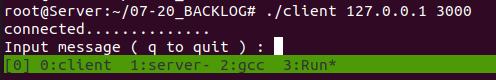
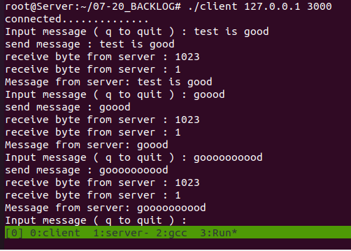
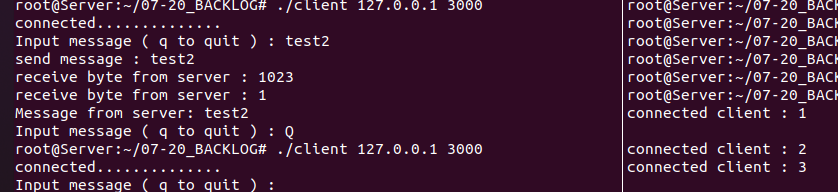

# 1. 리눅스에서의 소켓통신
<br>
<br>
<br>

<span style="color:red"> 참고용 코드 </span>


- <span style="color:orange"> 클라이언트 </span>

<details>
<summary> 코드 </summary>
<div markdown="1">

```c
#include <stdio.h>
#include <string.h>
#include <stdlib.h>
#include <arpa/inet.h>
#include <sys/socket.h>
#include <unistd.h>

#define BUF 1024

void error_handling(char* message);

int main(int argc, char* argv[])
{
    // definition
    int sock;
    struct sockaddr_in serv_addr;
    ssize_t str_len, recv_tot, recv_len;

    char message(BUF);

    // check
    if(argc != 3){
        printf("Usage : %s <IP> <PORT> \n", argv[0]);
        exit(1);
    }


    // socket
    sock = socket(PF_INET, SOCK_STREAM, 0);
    if(serv_sock == -1) error_handling("socket() error");

    memset(&serv_addr, 0, size(serv_addr));
    serv_addr.sin_family = AF_INET;
    serv_addr.sin_addr.s_addr = inet_addr(argv[1]);
    serv_addr.sin_port = htons(atoi(argv[2]));


    // connect
    if( connect(sock, (struct sockaddr*)&serv_addr, sizeof(serv_addr)) == -1)
        error_handling("connect error!");
    else
        printf("connected..........................\n");

    // accept
    while(1)
    {
        fputs("Input message ( q to quit )", stdout );
        fgets(message, BUF, stdin);
        if( !strcmp(message, "q\n") || !strcmp(message, "Q\n")) break;

        str_len = write(sock, message, BUF);
        if(str_len == -1) error_handling("write() error!");
        recv_tot = 0;

        while(recv_tot < str_len )
        {
            recv_len = read(sock, &message[recv_tot], BUF-1);
            if(recv_len == -1) error_handling("read() error!");
            recv_tot += recv_len;
        }
        message[recv_tot] = 0;
        printf("message from server : %s", message);

        // 여기안에다가 close 하니까 자꾸 끊기지 인마 ..
    }
    close(sock);
    return 0;
}

void error_handling(char* message)
{
    fputs(message, stderr);
    fputc('\n', stderr);
    exit(1);
}
```
</div>
</details>


- <span style="color:green"> 서버 </span>

<details>
<summary> 코드 </summary>
<div markdown="1">

```c
#include <stdio.h>
#include <string.h>
#include <stdlib.h>
#include <arpa/inet.h>
#include <sys/socket.h>
#include <unistd.h>

#define BUF 1024
#define BACKLOG 5

void error_handling(char* message);

int main(int argc, char* argv[])
{
    // definition
    int serv_sock;
    int clnt_sock;

    struct sockaddr_in serv_addr;
    struct sockaddr_in clnt_addr;

    socklen_t clnt_addr_size;

    int i;
    char message(BUF);
    ssize_t str_len;

    // check
    if(argc != 2){
        printf("Usage : %s <PORT> \n", argv[0]);
        exit(1);
    }


    // socket
    serv_sock = socket(PF_INET, SOCK_STREAM, 0);
    if(serv_sock == -1) error_handling("socket() error");

    memset(&serv_addr, 0, size(serv_addr));
    serv_addr.sin_family = AF_INET;
    serv_addr.sin_addr.s_addr = htonl(INADDR_ANY);
    serv_addr.sin_port = htons(atoi(argv[1]));

    // bind
    if( bind(serv_sock, (sturct sockaddr*)&serv_addr, sizeof(serv_addr)) == -1)
        error_handling("bind() error! ");

    // listen
    if( listen(serv_sock, BACKLOG) == -1)
        error_handling("listen() error! ");

    // for, size, accept
    for(i = 0; i < BACKLOG; i++)
    {
        clnt_addr_size = sizeof(clnt_addr);
        clnt_sock = accept(serv_sock, (struct sockaddr*)&clnt_addr, &clnt_addr_size);
        if(clnt_sock == -1) error_handling("accept() error!");

        while( ( str_len = read(clnt_sock, message, BUF-1)) != 0)
            write(clnt_sock, message, str_len);

        close(clnt_sock);
    }

    close(serv_sock);

    return 0;
}

void error_handling(char* message)
{
    fputs(message, stderr);
    fputc('\n', stderr);
    exit(1);
}
```
</div>
</details>
  


## 1. 기본 소켓통신에서 바뀐 점
<span style="color:yellow"> 클라이언트가 서버에서 한 줄의 메시지를 받고 클라에서 메시지를 출력했었었다. </span>
  - 


1. <span style="color:orange"> 클라이언트 </span>에서 문자열을 입력 (여기서 q나 Q를 쓰면 종료한다.)
   - 


2. 이상없을 시 문자열을 <span style="color:green"> 서버로 전송 </span>


3. <span style="color:green"> 서버 </span>가 판단없이 바로 문자열 다시 <span style="color:orange"> 클라이언트 </span> 로 전송
4. <span style="color:orange"> 클라이언트 </span> 가 받은 문자열을 화면에 출력
5. <span style="color:orange"> 클라이언트 </span> 가 q나 Q로 종료하지 않으면 계속 반복하게 된다.
   -   

6. <span style="color:orange"> 클라이언트 </span>가 종료하고 다시 연결하면 <span style="color:green"> 서버 </span>에서는 2번째 클라 연결이라고 출력
    -   


## 2. 과정 중 피드백
1. client
- <span style="color:orange"> close() </span>  위치 신경 쓸 것


2. server
- inet_addr() 아니라 <span style="color:green"> htonl(INADDR_ANY) </span>  라는 것