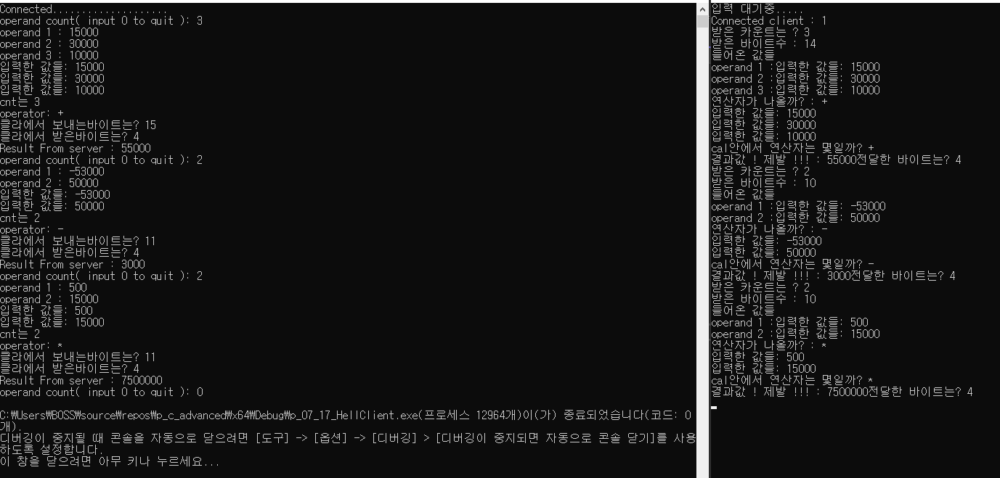
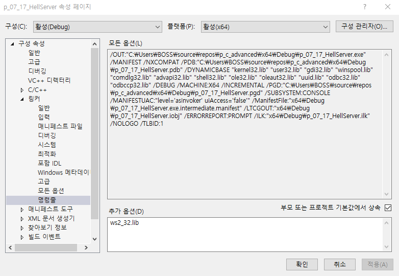
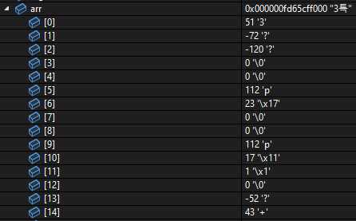

<details>
<summary> 처음 풀 때 걸린시간 </summary>
<div markdown="1">
8시간
</div>
</details>

# 1. 문제

- 필요한 결과물 사진
-   

1. <span style="color:orange"> 클라이언트 </span>에서 연산에 쓰일 연산자의 개수를 입력한다.
2. 연산자의 개수만큼 숫자들을 입력하고난 뒤 연산자를 입력한다 ( +, -, * 만 ! 나누기는 제외한다. )
3. <span style="color:green"> 서버 </span>에서 연산결과를 받아와서 <span style="color:orange"> 클라이언트 </span>에서 출력한다.
- 전 문제와 마찬가지로 <span style="color:red"> 종료할 때는 count를 0 </span>으로 주고, <span style="color:green"> 서버 </span>는 <span style="color:indigo"> BACKLOG </span> 만큼 호스트를 받을 수 있어야한다.

<span style="color:red"> 반드시 지켜야 할 조건 </span>
- 
- char형 배열을 <span style="color:yellow"> 1바이트(count) 4바이트(int형 숫자) ... 4바이트(int형 숫자) 1바이트(연산자) </span> -> 이런식으로 크기 할당을 해야한다.


<br>
<br>
<br>
<br>
<br>
<br>
<br>
<br>


# 2. 정답

<details>
<summary> <span style="color:orange"> 클라이언트 </span> 정답 </summary>
<div markdown="1">

```c
#include <stdio.h>
#include <stdlib.h>
#include <ws2tcpip.h>
#include <winsock2.h>

#define BUF 1024
#define INT 4

void errorHandling(char* message);

int main(int argc, char* argv[])
{
	// definition
	WSADATA wsadata;
	SOCKET hSocket;
	SOCKADDR_IN servAddr;

	SSIZE_T recvLen, strLen;

	int i, j;
	char result[INT]; // define to char because of second parameter of recv function -> char* buf 
	char arr[BUF]; // array
	int count, forgetchar; // count, getchar
	int temp; // scanf_s


	// parameter check
	if (argc != 3)
	{
		printf("Usage: %s <IP> <PORT> \n", argv[0]);
		exit(1);
	}

	// init
	if (WSAStartup(MAKEWORD(2, 2), &wsadata) != 0)
		errorHandling("WSAstartup() error");

	// socket
	hSocket = socket(PF_INET, SOCK_STREAM, 0);
	if (hSocket == INVALID_SOCKET)
		errorHandling("socket() error");

	// memset init
	memset(&servAddr, 0, sizeof(servAddr));
	servAddr.sin_family = AF_INET;
	inet_pton(AF_INET, argv[1], &servAddr.sin_addr); // <ws2tcpip.h>
	servAddr.sin_port = htons(atoi(argv[2]));

	// connect
	if (connect(hSocket, (SOCKADDR*)&servAddr, sizeof(servAddr)) == SOCKET_ERROR)
		errorHandling("connect() error");
	else
		printf("connected......................\n");


	// input
	while (1)
	{
		// count
		printf("operand count ( input 0 to quit ): ");
		scanf_s("%c", &arr[0], (unsigned int)sizeof(int));
		count = atoi(&arr[0]);
		if (count == 0) break;
		printf("받은 카운트는 : %d \n", count);


		// scanf_s
		j = 1;
		for (i = 1; i < count * INT; i += INT)
		{
			printf("operand %d :", j++);
			scanf_s("%d", &temp);
			forgetchar = getchar();
			arr[i + 0] = temp;
			arr[i + 1] = temp >> 8;
			arr[i + 2] = temp >> 16;
			arr[i + 3] = temp >> 24;
		}

	/*	for (i = 1; i < count * INT; i += INT)
			printf("입력된 값들: %d \n", *((int*)(arr + i)));*/

		// (arr+i) -> 주소값
		// (int*) -> 포인터
		// *(  ) -> 참조값
		// 결과 *((int*)(arr + i))

		// arr[i] -> 참조값
		// (int*) -> 포인터
		// 결과: *((int*)&(arr[i])) ㅋㅋㅋ

		// operator
		printf("operator: ");
		scanf_s("%c", &arr[count * INT + 2], (unsigned char)sizeof(char));
		forgetchar = getchar();


		// send & recv
		strLen = send(hSocket, arr, sizeof(int) * count + 3, 0);
		if (strLen == -1) errorHandling("send() error");
		printf("클라에서 보내는바이트는? %d \n", (int)strLen);


		recvLen = recv(hSocket, result, sizeof(result), 0);
		if (recvLen == -1) errorHandling("recv() error");
		printf("클라에서 받은바이트는? %d \n", (int)recvLen);

		// result
		printf("Result from server : %d \n", *((int*)result));


	}

	closesocket(hSocket);
	WSACleanup();

	return 0;
}


void errorHandling(char* message)
{
	fputs(message, stderr);
	fputc('\n', stderr);
	exit(1);
}
```

</div>
</details>


<details>
<summary> <span style="color:green"> 서버 </span> 정답 </summary>
<div markdown="1">

```c
#include <stdio.h>
#include <stdlib.h>
#include <ws2tcpip.h>
#include <winsock2.h>

#define BUF 1024
#define INT 4
#define BACKLOG 5
#define CHAR 1

void errorHandling(char* message);
int cal(unsigned char* arr, int cnt, char oper);

int main(int argc, char* argv[])
{
	// definition
	WSADATA wsadata;
	SOCKET hServSock, hClntSock;
	SOCKADDR_IN servAddr, clntAddr;

	int szClntAddr;

	// parameter check
	if (argc != 2)
	{
		printf("Usage : %s <PORT> \n", argv[0]);
		exit(1);
	}

	// init
	if (WSAStartup(MAKEWORD(2, 2), &wsadata) != 0)
		errorHandling("WSAstartup() error");

	// socket()
	hServSock = socket(PF_INET, SOCK_STREAM, 0);
	if (hServSock == INVALID_SOCKET)
		errorHandling("socket() error");


	// memset init
	memset(&servAddr, 0, sizeof(servAddr));
	servAddr.sin_family = AF_INET;
	servAddr.sin_addr.s_addr = htonl(INADDR_ANY);
	servAddr.sin_port = htons(atoi(argv[1]));

	// bind()
	if( bind(hServSock, (SOCKADDR*)&servAddr, sizeof(servAddr)) == SOCKET_ERROR )
		errorHandling("bind() error");

	// listen()
	if (listen(hServSock, BACKLOG) == SOCKET_ERROR)
		errorHandling("listen() error");
	else
		printf("입력 대기 중 ..... \n");


	// accept()
	int rep;
	SSIZE_T strLen, recvLen, recvTot, sendLen;
	char arr[BUF];
	int count;
	int result;
	int i, j; // for operand values check

	for (rep = 0; rep < BACKLOG; rep++)
	{
		// size
		szClntAddr = sizeof(clntAddr);

		// accept
		hClntSock = accept(hServSock, (SOCKADDR*)&clntAddr, &szClntAddr);
		if (hClntSock == INVALID_SOCKET) errorHandling("accept() error");


		// recv, write
		while ((strLen = recv(hClntSock, arr, CHAR, 0) != 0))
		{
			if (strLen == SOCKET_ERROR) errorHandling("recv() error");
			printf("서버에서 받은 바이트 수 : %d \n", (int)strLen);

			// 바꿔서 받아야지 인마
			count = atoi(&arr[0]);
			printf("받은 카운트 수 : %d \n", count);

			recvTot = 1; // 카운트 하나 받았으니까 1개 빼자.
			recvLen = 1; // 마찬가지
			while (recvTot < count*INT + 2)
			{
				recvLen = recv(hClntSock, &arr[recvTot], BUF - 1, 0);
				if (recvLen == SOCKET_ERROR) errorHandling("recv() error");
				printf("서버에서 받은 바이트 수 : %d\n", (int)recvLen);
				recvTot += recvLen;
			}
			
			// check operands
			j = 1;
			for (i = 1; i < count * INT; i += INT)
			{
				printf("들어온 operand %d :", j++);
				printf("%d \n", *((int*)(arr + i)));
			}

			// operator check
			printf("operator : %c \n", arr[count * INT + 2]);

			// call calculator
			// arr의 첫번째 주소값을 줬기 때문에 cal 함수 안에서 i = 1 부터 시작한 것
			// 다른 프로젝트에선 &arr[1] 이렇게 주었기 때문에 cal함수 안에서 i = 0으로 시작해도 됐었다는 것.
			result = cal(arr, count, arr[count * INT + 2]);
			printf("결과값은 : %d \n", result);

			sendLen = send(hClntSock, &result, sizeof(result), 0);
			if (sendLen == SOCKET_ERROR) errorHandling("send() error");
			printf("전달한 바이트는? %d \n", (int)sendLen);

		}

		// close() -> client
		closesocket(hClntSock);
	}

	

	// close() -> server
	closesocket(hServSock);
	WSACleanup();

	return 0;
}


void errorHandling(char* message) 
{
	fputs(message, stderr);
	fputc('\n', stderr);
	exit(1);
}


int cal(unsigned char* arr, int cnt, char oper)
{
	int i, result = 0;

	// check
	for (i = 1; i < cnt * INT; i += INT)
		printf("입력한 값 %d : %d \n", i + 1, *((int*)(arr + i)));

	for (i = 1; i < cnt * INT; i += INT)
	{
		if (oper == '+')				result += *((int*)(arr + i));
		else if ( oper == '-')		result -= *((int*)(arr + i));
		else if (oper == '*')
		{
			if (i == 1) result = 1;
			result *= *((int*)(arr + i));
		}

	}
	

	return result;
}
```

</div>
</details>

<br>
<br>
<br>
<br>
<br>
<br>
<br>
<br>


# 3. 피드백
1. 프로젝트를 새로 만들어서 해야할 때는 다음 사진과 같이 <span style="color:yellow"> ws2_32.lib </span> 라이브러리를 <span style="color:orange"> 추가 </span> 해야한다.
   -   

## 3-1. <span style="color:orange"> 클라이언트 </span> 피드백
1. parameter check 까먹지 말 것
2. <span style="color:yellow"> inet_pton() </span> 은 <span style="color:orange"> 클라이언트 </span>에서만 쓰이고, 쓰기 위한 <span style="color:violet"> 헤더</span>는 <span style="color:violet"> ws2tcpip.h </span> 라는 것

3. <span style="color:#87CEEB"> \*((int*)(arr+i)) </span> 에 대해서

```c
(arr+i) -> 주소값
(int*)  -> 포인터
*(  )   -> 참조값
결과:   *((int*)(arr + i))

arr[i]  -> 참조값
(int*)  -> 포인터
결과:   *((int*)&(arr[i])) // 좋지 않은 방법 ( 가독성 떨어짐 )
```


## 3-2. <span style="color:green"> 서버 </span> 피드백
1. 받을 때 크기가 다르게 했던 이유 ( 꼭 이렇게 하지 않아도 된다. )
-   
배열의 값들을 보면 13번 인덱스에 <span style="color:red"> 아무것도 </span> 들어있지 않다. <br>
그것은 <span style="color:green"> 서버 </span>에서는 변수<span style="color:skyblue"> count </span>를 위해서 <span style="color:yellow"> recv </span>함수를 미리 한 번 썼기 때문이다.<br>
그래서 2번째 <span style="color:yellow"> recv() </span>함수를 읽어올 때는 배열의 첫번째인 0 인덱스가 아닌 <br>
두번째인 1인덱스부터 읽기 때문에 한 자리가 비어있는 것. <br>


## 3-3. <span style="color:#00FFFF"> 공용 </span> 피드백
<span style="color:red"> 중요한 keypoint </span> <br>
-

```c
char형 배열에 int만큼의 크기를 넣는 방법은 강제 캐스팅이 아닌
비트 연산자였다는 것.

#define INT 4

int i;
int temp;
int cnt = 3;
for( i = 0 ; i < cnt * INT ; i+=4)
{
scanf_s("%d", &temp);
arr[i + 0] = temp;
arr[i + 1] = temp >> 8;
arr[i + 2] = temp >> 16;
arr[i + 3] = temp >> 24;
}
```

위처럼 <span style="color:#87CEEB"> temp라는 int형 변수 </span> 에 숫자를 비트별로 나누어서 <br>
arr의 char형 배열에 <span style="color:yellow"> <u>1인덱스씩 4번 각각 대입 </u></span> 한 것 <br>
이 방법이 <span style="color:red"> **keypoint** </span> 였다고 생각한다.
