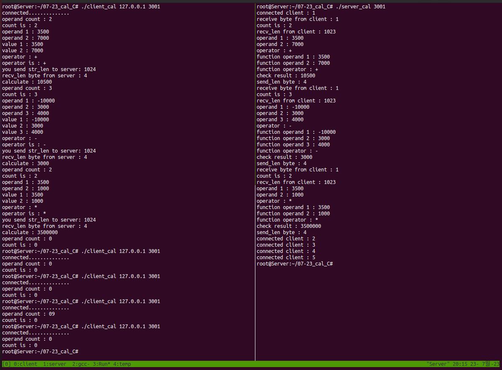

# 1. 문제

- 필요한 결과물 사진
-   
 
1. <span style="color:orange"> 클라이언트 </span>에서 연산에 쓰일 연산자의 개수를 입력한다.
2. 연산자의 개수만큼 숫자들을 입력하고난 뒤 연산자를 입력한다 ( +, -, * 만 ! 나누기는 제외한다. )
3. <span style="color:green"> 서버 </span>에서 연산결과를 받아와서 <span style="color:orange"> 클라이언트 </span>에서 출력한다.
- 전 문제와 마찬가지로 <span style="color:red"> 종료할 때는 count를 0 </span>으로 주고, <span style="color:green"> 서버 </span>는 <span style="color:indigo"> BACKLOG </span> 만큼 호스트를 받을 수 있어야한다.

<span style="color:red"> 반드시 지켜야 할 조건 </span>
- 
- char형 배열을 <span style="color:yellow"> 1바이트(count) 4바이트(int형 숫자) ... 4바이트(int형 숫자) 1바이트(연산자) </span> -> 이런식으로 크기 할당을 해야한다.


<br>
<br>
<br>
<br>
<br>
<br>
<br>
<br>


# 2. 정답

<details>
<summary> <span style="color:orange"> 클라이언트 </span>정답 </summary>
<div markdown="1">

```c
#include <stdio.h>
#include <stdlib.h>
#include <string.h>
#include <unistd.h>
#include <arpa/inet.h>
#include <sys/socket.h>

#define BUF 1024
#define INT 4

void error_handling(char* message);

int main(int argc, char* argv[])
{
        int sock;
        struct sockaddr_in serv_addr;

        char message_send[BUF];
        ssize_t str_len, recv_tot, recv_len;

        if (argc != 3){
                printf("Usage : %s <IP> <port> \n", argv[0]);
        }

        sock = socket(PF_INET, SOCK_STREAM, 0);
        if (sock == -1)
                error_handling("socket() error");


        memset(&serv_addr, 0, sizeof(serv_addr));
        serv_addr.sin_family = AF_INET;
        serv_addr.sin_addr.s_addr = inet_addr(argv[1]);
        serv_addr.sin_port = htons(atoi(argv[2]));

        if(connect (sock, (struct sockaddr*)&serv_addr, sizeof(serv_addr)) == -1)
                error_handling("connect() error");
        else
                printf("connected..............\n");

        int value;
        int count;
        char arr[BUF];
        int i, j;
        int result;
        while(1)
        {
        printf("operand count : ");
        scanf("%c", &arr[0]);
        getchar();
        count = atoi(&arr[0]);
        printf("count is : %d \n", count);
        if(arr[0] == '0') break;

        j = 1;
        for(i = 1; i < count*INT; i+=INT)
        {
        printf("operand %d : ", j++);
        scanf("%d", &value);
        getchar();
        arr[i + 0] = value;
        arr[i + 1] = value >> 8;
        arr[i + 2] = value >> 16;
        arr[i + 3] = value >> 24;
        }

        // check for casting to int array
        j = 1;
        for(i = 1; i < count*INT; i += INT)
                printf("value %d : %d \n", j++, *((int*)(arr+i)));

        // operator
        printf("operator : ");
        scanf("%c", &arr[count * INT + 2]);
        getchar();
        printf("operator is : %c \n", arr[count* INT + 2]);


        // send
        str_len = write(sock, arr, BUF);
        if(str_len == -1) error_handling("write() error");
        printf("you send str_len to server: %d \n", (int)str_len);

        // recv
        recv_len = read(sock, &result, sizeof(result));
        if(recv_len == -1) error_handling("recv_len read() error");
        printf("recv_len byte from server : %d \n", (int)recv_len);


        // result
        printf("calculate : %d \n", result);

        // : norm i//
        // : norm 1x -> first word delete
        // : norm 2x -> frist&&second words delete
        }
close(sock);
        return 0;
}

void error_handling(char* message)
{
        fputs(message, stderr);
        fputc('\n', stderr);
        exit(1);
}
```
</div>
</details>


<details>
<summary> <span style="color:green"> 서버 </span>정답 </summary>
<div markdown="1">

```c
#include <stdio.h>
#include <stdlib.h>
#include <string.h>
#include <unistd.h>
#include <arpa/inet.h>
#include <sys/socket.h>

#define BUF 1024
#define BACKLOG 5
#define INT 4

int cal_arr(char arr[], int cnt, char oper);
void error_handling(char* message);

int main(int argc, char* argv[])
{
        int serv_sock;
        int clnt_sock;
        struct sockaddr_in serv_addr;
        struct sockaddr_in clnt_addr;

        socklen_t clnt_addr_size;

        int i;
        ssize_t str_len;

        if(argc != 2){
                printf("Usage : %s <port> \n", argv[0]);
                exit(1);
        }

        serv_sock = socket(PF_INET, SOCK_STREAM, 0);
        if (serv_sock == -1)
                error_handling("socket() error");

        memset(&serv_addr, 0, sizeof(serv_addr));
        serv_addr.sin_family = AF_INET;
        serv_addr.sin_addr.s_addr = htonl(INADDR_ANY);
        serv_addr.sin_port = htons(atoi(argv[1]));

        if(bind(serv_sock, (struct sockaddr*) &serv_addr, sizeof(serv_addr)) == -1)
                error_handling("bind() error");

        if(listen(serv_sock, BACKLOG) == -1)
                error_handling("listen() error");

        ssize_t test, recv_len, send_len, recv_tot;
        char arr[BUF];
        int count, result;
        int j;
        int rep;

        for(rep = 0; rep < BACKLOG; rep++)
        {
        clnt_addr_size = sizeof(clnt_addr);
        clnt_sock = accept(serv_sock, (struct sockaddr*)&clnt_addr, &clnt_addr_size);
        if(clnt_sock == -1)
                error_handling("accept() error");
        else
                printf("connected client : %d \n", rep+1);


        // for client repeat
        while(( str_len = read(clnt_sock, arr, sizeof(char)) != 0 ))
        {
        // read count 1byte
        if(str_len == -1) error_handling("str_len read() error");
        printf("receive byte from client : %d \n", (int)str_len);
        count = atoi(&arr[0]);
        printf("count is : %d \n", count);


        // for receive operand values
        recv_tot = 1;
        recv_len = 1; // for start except index 0
        while(recv_tot < count*INT + 2)
        {
        recv_len = read(clnt_sock, &arr[recv_len], BUF-1);
        if(recv_len == -1) error_handling("recv_len read() error");
        printf("recv_len from client : %d \n", (int)recv_len);
        recv_tot += recv_len;
        }
        // operand check 4 bytes each
        j = 1;
        for(i = 1; i < count * INT; i+=INT)
                printf("operand %d : %d \n", j++, *((int*)(arr+i)));


        // check operator
        printf("operator : %c \n", arr[count * INT +2]);

        // calculator function
        result = cal_arr(arr, count, arr[count*INT+2]);

        // Check result
        printf("check result : %d \n", result);

        // send result
        send_len = write(clnt_sock, &result, sizeof(result));
        if(send_len == -1) error_handling("send_len write() error");
        printf("send_len byte : %d \n", (int)send_len);

        } // while
//      printf("end \n");      
        close(clnt_sock);
//      printf("rep is : %d", rep+1);
        } // for


//      printf("server end \n");
        close(serv_sock);

        return 0;
}


void error_handling(char* message)
{
        fputs(message, stderr);
        fputc('\n', stderr);
        exit(1);
}


int cal_arr(char arr[], int cnt, char oper)
{
        int i, j, result = 0;
        // check
        j = 1;
        for(i = 1; i < cnt*INT; i+=INT)
                printf("function operand %d : %d \n", j++, *((int*)(arr + i)));

        // check operatior
        printf("function operator : %c \n", oper);
        // calculate
        for(i = 1; i < cnt*INT; i += INT)
        {
        if(oper == '+')         result += *((int*)(arr+i));
        else if(oper == '-')    result -= *((int*)(arr+i));
        else if(oper == '*') {
                        if( i == 1 ) result = 1;
                        result *= *((int*)(arr+i));
                }
        }

        // return
        return result;
}
```
</div>
</details>


<br>
<br>
<br>
<br>
<br>
<br>
<br>
<br>


# 3. 피드백

## 1. 결과를 한 번밖에 받지 못하고 ( <span style="color:green"> 서버 </span>가 종료되지는 않음 ), while문을 엄청 많이 돌고 있는 것을 발견함

- 해결
1. 첫 read의 size를 1 이 아닌 <span style="color:blue"> sizeof(char) </span> 로 하니까 정상작동함


## 2. Host가 연결을 끊고 다음 호스트가 와야할 차례에 <span style="color:green"> 서버 </span>가 종료가 됨

```
해결하려는 시도
1. client에서의 break가 잘못된건가 싶어서 위치를 조정해봤음
```

- 해결
1. printf로 비정상적인지 확인해봤으나 <span style="color:green"> 정상적인 종료 </span> 를 확인함 <br>
그래서 for문의 i 변수의 값을 확인해봤더니, <span style="color:red"> 마지막에 i가 9로 변해 </span> 있었음 <br>
즉, <span style="color:yellow"> 변수 i의 남발 </span> 로 인한 조기종료였음을 확인 <br>
<span style="color:#87CEEB"> **BACKLOG용 for문 변수 rep를 새로 선언** </span> 하여 해결