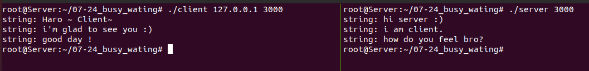

# 1. 문제


- 결과물 사진
-   

1. <span style="color:orange"> 클라이언트 </span>에서 <span style="color:green"> 서버 </span>로 문자열의 길이를 보낸다.
2. 그 다음에 문자열을 보낸다.
3. <span style="color:green"> 서버 </span>는 길이를 받고, 그 뒤에 문자열을 받아서 출력한다.
4. 그 다음 <span style="color:green"> 서버 </span>가 <span style="color:orange"> 클라이언트 </span>에게 문자열의 길이를 보낸다.
5. 그 다음에 문자열을 보낸다.


<br>
<br>
<br>
<br>
<br>
<br>
<br>
<br>


# 2. 정답


<details>
<summary> <span style="color:orange"> 클라이언트 </span> 정답 </summary>
<div markdown="1">

```c
#include <stdio.h>
#include <stdlib.h>
#include <string.h>
#include <unistd.h>
#include <arpa/inet.h>
#include <sys/socket.h>

#define BUF 1024

void error_handling(char* message);

int main(int argc, char* argv[])
{
    // basic def
    int sock;
    struct sockaddr_in serv_addr;


    


    // argc check
    if(argc != 3)
    {
        printf("Usage : %s <IP> <PORT> \n", argv[0]);
        exit(1);
    }

    // socket()
    sock = socket(PF_INET, SOCK_STREAM, 0);
    if(sock == -1) error_handling("socket() error");

    // memset init
    memset(&serv_addr, 0, sizeof(serv_addr));
    serv_addr.sin_family = AF_INET;
    serv_addr.sin_addr.s_addr = inet_addr(argv[1]);
    serv_addr.sin_port = htons(atoi(argv[2]));

    // connect
    if( connect(sock, (struct sockaddr*)&serv_addr,  sizeof(serv_addr)) == -1)
        error_handling("connect() error");
    else
        printf("connected..............................\n");


    // coinside str trade def
    char msg1[] = "Hi server ! ";
    char msg2[] = "i am clie...groot";
    char msg3[] = "i am grooooooooot!!!!";

    char* msg[3] = {msg1, msg2, msg3};

    char read_buf[BUF]; // BUF 1024
    

    // for write
    int i, cnt_w;
    ssize_t ck_cnt_w_len, ck_str_w_len;

    // for read
    int cnt_r, str_tot;
    ssize_t ck_cnt_r_len, ck_str_r_len;


    // control
    for(i = 0; i < 3; i++)
    {
        // write cnt
        cnt_w = strlen(msg[i]);
        printf("cnt_w : %d \n", cnt_w);
        ck_cnt_w_len = write(sock, &cnt_w, sizeof(int));
        if( ck_cnt_w_len == -1) error_handling("ck_cnt_w_len is -1 !! error ");
        printf("ck_cnt_w_len : %d \n", (int)ck_cnt_w_len);


        // write str
        ck_str_w_len = write(sock, msg[i], cnt_w);
        if(ck_str_w_len == -1) error_handling("ck_str_w_len error ");
        printf("ck_str_w_len : %d \n", (int)ck_str_w_len);


        // read cnt
        ck_cnt_r_len = read(sock, &cnt_r, sizeof(int));
        if(ck_cnt_r_len == -1) error_handling("read() error");
        printf("ck_cnt_r_len : %d \n", (int)ck_cnt_r_len);

        
        // read str
        str_tot = 0;
        ck_str_r_len = read(sock, &read_buf[str_tot], cnt_r);
        if(ck_str_r_len == -1) error_handling("read() error");
        printf("ck_str_r_len : %d \n", (int)ck_str_r_len);
        read_buf[str_tot + ck_str_r_len] = '\0';

        printf(" %s \n", &read_buf[str_tot]);

        str_tot += (ck_str_r_len + 1); // +1 -> NULL space
    }
    close(sock);


    return 0;
}


void error_handling(char* message)
{
    fputs(message, stderr);
    fputc('\n', stderr);
    exit(1);
}


```
</div>
</details>


<br>
<br>
<br>
<br>


<details>
<summary> <span style="color:green"> 서버 </span>정답 </summary>
<div markdown="1">

```c
#include <stdio.h>
#include <stdlib.h>
#include <string.h>
#include <unistd.h>
#include <arpa/inet.h>
#include <sys/socket.h>

#define BAKCLOG 5
#define BUF 1024

void error_handling(char* message);

int main(int argc, char* argv[])
{
    // basic def
    int serv_sock;
    int clnt_sock;

    struct sockaddr_in serv_addr;
    struct sockaddr_in clnt_addr;

    socklen_t clnt_addr_size;


    // argc check
    if(argc != 2)
    {
        printf("Usage : %s <POTR> \n", argv[0]);
        exit(1);
    }

    // socket()
    serv_sock = socket(PF_INET, SOCK_STREAM, 0);
    if(serv_sock == -1 ) error_handling("socket() error");

    // memset init
    memset(&serv_addr, 0, sizeof(serv_addr));
    serv_addr.sin_family = AF_INET;
    serv_addr.sin_addr.s_addr = htonl(INADDR_ANY);
    serv_addr.sin_port = htons(atoi(argv[1]));

    // bind()
    if( bind(serv_sock, (struct sockaddr*)&serv_addr, sizeof(serv_addr)) == -1)
        error_handling("bind() error");

    // listen()
    if( listen(serv_sock, 5) == -1)
        error_handling("listen() error");

    // size, accept
    clnt_addr_size = sizeof(clnt_addr);
    clnt_sock = accept(serv_sock, (struct sockaddr*)&clnt_addr, &clnt_addr_size);
    if(clnt_sock == -1) error_handling("accept() error");


    // coinside str trade def
    char msg1[] = "yo what'up bro";
    char msg2[] = "what is mean groot bro";
    char msg3[] = "OMG ruuuuuunnn!!";

    char* msg[3] = {msg1, msg2, msg3};
    
    char read_buf[BUF]; // BUF 1024


    // for read
    int i, cnt_r, str_tot;
    ssize_t ck_cnt_r_len, ck_str_r_len;
    
    // for write
    int cnt_w;
    ssize_t ck_cnt_w_len, ck_str_w_len;


    for(i = 0; i < 3; i++)
    {
        // read cnt
        ck_cnt_r_len = read(clnt_sock, &cnt_r, sizeof(int));
        printf("ck_cnt_r_len : %d \n", (int)ck_cnt_r_len);


        str_tot = 0;
        // read str
        ck_str_r_len = read(clnt_sock, &read_buf[str_tot], cnt_r);
        printf("ck_str_r_len : %d \n", (int)ck_str_r_len);
        read_buf[str_tot + ck_str_r_len] = '\0';

        printf("%s \n", &read_buf[str_tot]);

        str_tot += ck_str_r_len+1; // for null space -> +1


        // write cnt
        cnt_w = strlen(msg[i]);
        ck_cnt_w_len = write(clnt_sock, &cnt_w, sizeof(int));
        if(ck_cnt_w_len == -1) error_handling("write() error");

        // write str
        ck_str_w_len = write(clnt_sock, msg[i], cnt_w);
        if(ck_str_w_len == -1) error_handling("write(2) error");

    }

    close(clnt_sock);
    close(serv_sock);
    return 0;
}

void error_handling(char* message)
{
    fputs(message, stderr);
    fputc('\n', stderr);
    exit(1);
}


```
</div>
</details>


<br>
<br>
<br>
<br>
<br>
<br>
<br>
<br>


# 3. 피드백


## 1. 포인터 배열의 주소값 이용을 제대로 못 함 
- 상황

```c
char msg1[] = "Hello";
char msg2[] = "Hello2";
char msg3[] = "Hello3";

char *msg[3] = {msg1, msg2, msg3};

char read_buf[BUF]; // BUF 1024
```
- 이 부분에서 msg라는 포인터형 배열의 값들인 msg1, msg2, msg3 변수들이 <br>
주소값들을 나타내고 있다는 것을 인지하지 못하고, <br>
<span style="color:yellow"> write() </span>에서 &msg[i] 이런식으로 사용을 하게되어, <br>
Hello라는 문자열을 가리키는 주소가 아니라 msg1이라는 변수를 가리키는 주소를 보내버렸다..<br>


<span style="color:red"> **<u>정말 <span style="color:yellow"> 주의 </span> 하도록 하자. <br>
이거 찾는데만 <span style="color:yellow"> 1시간 30분 </span>이 넘게 걸렸다. </u>** </span>


## 2. cnt를 읽어올 때 sizeof()의 부재
- 상황: <span style="color:orange"> 클라이언트 </span>에서 <span style="color:green"> 서버 </span>로 문자열의 길이와 문자열을 보냈고, 얼마나 보냈는지 모두 확인했지만 <br>
<span style="color:green"> 서버 </span>에서는 문자열을 받을 수 없었다.
- <span style="color:green"> 서버 </span>에서 받아온 문자열의 크기와 문자열의 바이트 수를 확인했지만 그래도 <span style="color:orange"> %s </span> 로 뽑아올 수 없었다.

<span style="color:red"> 원인 : </span> <span style="color:orange"> 클라이언트 </span>에서 문자열의 길이를 줄 때 sizeof(int) 크기만큼 주는게 아니라 <br>
cnt_w 만큼 주었기 때문에 문자열의 크기만큼을 보냈으므로 처음엔 <span style="color:green"> 운이 좋아서 </span> 잘 되었을지 모르나, <br>
 시간이 지날수록 <span style="color:green"> 서버 </span>에서 받는 <span style="color:yellow"> cnt_r의 크기가 쓰레기 값 </span> 으로 변했다.

<br>
<span style="color:green"> 해결  </span> <br>
read()함수를 쓸 때 문자열의 길이를 보내줄 때 사이즈에 신경써서 <span style="color:#87CEEB"> sizeof(int) </span>로 꼭 <span style="color:yellow"> 4바이트 </span>를 보내주자 !!!


## 3. 기본 소켓통신의 코드 중 까먹은 부분들이 있었음
- fin_family가 아니라 <span style="color:yellow"> sin_family </span> !!!
- <span style="color:green"> 서버 </span>에서는 inet_addr이 아니라 <span style="color:yellow"> htonl(INADDR_ANY) </span> !!