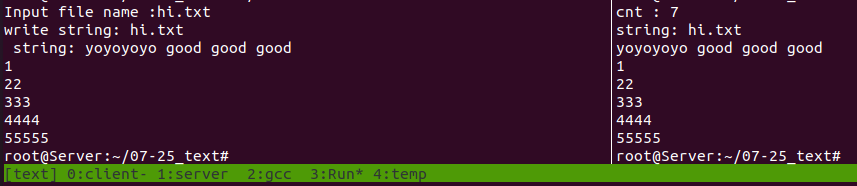

# 1. 문제

<span style="color:orange"> 클라이언트 </span>

```
텍스트와 바이너리
파일의 이름을 사용자에게 받은 뒤 서버에게 파일의 이름을 전송

파일이 존재한다면 서버에게 파일의 내용을 전송받아서 출력

바이너리는 클라이언트에게 파일의 데이터를 전송해서
받은 데이터로 같은 파일을 생성 !
```

<span style="color:green"> 서버 </span>

```
클라이언트에게 파일의 이름을 전송받고,

파일 입출력으로 파일 이름을 비교 !

있으면 전송하고 없으면 연결 종료
```

-   


<br>
<br>
<br>
<br>
<br>
<br>
<br>
<br>

# 2. 정답


## 2-1. 텍스트 전송

<details>
<summary> <span style="color:orange"> 클라이언트 </span> </summary>
<div markdown="1">

```C
#include <stdio.h>
#include <stdlib.h>
#include <string.h>
#include <unistd.h>
#include <arpa/inet.h>
#include <sys/socket.h>

// new
#define BUF 1024

void error_handling(char* message);

int main(int argc, char* argv[])
{
        int sock;
        struct sockaddr_in serv_addr;
        int str_len;

        if (argc != 3){
                printf("Usage : %s <IP> <port> \n", argv[0]);
        }

        sock = socket(PF_INET, SOCK_STREAM, 0);
        if (sock == -1)
                error_handling("socket() error");


        memset(&serv_addr, 0, sizeof(serv_addr));
        serv_addr.sin_family = AF_INET;
        serv_addr.sin_addr.s_addr = inet_addr(argv[1]);
        serv_addr.sin_port = htons(atoi(argv[2]));

        if(connect (sock, (struct sockaddr*)&serv_addr, sizeof(serv_addr)) == -1)
                error_handling("connect() error");


        // New Question definition
        char file_name[BUF]; // BUF 1024        
        char recv_file[BUF];

        int cnt;
        ssize_t ck_cnt_w_len, ck_str_w_len;
        int cnt_r, str_tot;
        ssize_t ck_cnt_r_len, ck_str_r_len;

        // file name
        printf("Input file name :");
        fgets(file_name, BUF, stdin);


        // write str len
        cnt = strlen(file_name);
//      printf("cnt: %d \n", cnt);

        file_name[cnt] = 0;

        ck_cnt_w_len = write(sock, &cnt, sizeof(int));
//      printf("ck_cnt_w_len : %d \n", (int)ck_cnt_w_len);


        // write str
        ck_str_w_len = write(sock, file_name, cnt);
//      printf("ck_str_w_len : %d \n", (int)ck_str_w_len);
        printf("write string: %s ", file_name);


        // read cnt
        ck_cnt_r_len = read(sock, &cnt_r, sizeof(int));

        // read str
        ck_str_r_len = read(sock, recv_file, cnt_r-1);


        printf("%s\n", recv_file);


        // close
        close(sock);

        return 0;
}

void error_handling(char* message)
{
        fputs(message, stderr);
        fputc('\n', stderr);
        exit(1);
}

```
</div>
</details>


<details>
<summary> <span style="color:green"> 서버 </span> </summary>
<div markdown="1">

```C
#include <stdio.h>
#include <stdlib.h>
#include <string.h>
#include <unistd.h>
#include <arpa/inet.h>
#include <sys/socket.h>

// new
#define BUF 1024


void error_handling(char* message);

int main(int argc, char* argv[])
{
        int serv_sock;
        int clnt_sock;
        struct sockaddr_in serv_addr;
        struct sockaddr_in clnt_addr;

        socklen_t clnt_addr_size;


        if(argc != 2){
                printf("Usage : %s <port> \n", argv[0]);
                exit(1);
        }

        serv_sock = socket(PF_INET, SOCK_STREAM, 0);
        if (serv_sock == -1)
                error_handling("socket() error");

        memset(&serv_addr, 0, sizeof(serv_addr));
        serv_addr.sin_family = AF_INET;
        serv_addr.sin_addr.s_addr = htonl(INADDR_ANY);
        serv_addr.sin_port = htons(atoi(argv[1]));

        if(bind(serv_sock, (struct sockaddr*) &serv_addr, sizeof(serv_addr)) == -1)
                error_handling("bind() error");

        if(listen(serv_sock, 5) == -1)
                error_handling("listen() error");

        clnt_addr_size = sizeof(clnt_addr);
        clnt_sock = accept(serv_sock, (struct sockaddr*)&clnt_addr, &clnt_addr_size);
        if(clnt_sock == -1)
                error_handling("accept() error");


        // New Question def
        char file_name[BUF]; // BUF 1024
        char file_str[BUF];

        int cnt, cnt_fread;
        int cnt_w;

        ssize_t ck_cnt_r_len, ck_str_r_len;
        ssize_t ck_cnt_w_len, ck_str_w_len;


        // receive cnt  
        ck_cnt_r_len = read(clnt_sock, &cnt, sizeof(int));
//      printf("ck_cnt_r_len : %d \n", (int)ck_cnt_r_len);
        printf("cnt : %d \n", cnt);

        // receive str
        ck_str_r_len = read(clnt_sock, file_name, cnt-1);
//      printf("ck_str_r_len : %d \n", (int)ck_str_r_len);
//      file_name[cnt+1] = '\0';
        printf("string: %s \n", file_name);


        // FILE*
        FILE* text_fp;
        text_fp = fopen(file_name, "rt");

        while( ( cnt_fread = fread(file_str, sizeof(char), sizeof(file_str), text_fp) ) != 0)
        {
            printf("%s", file_str);
            // write cnt
            cnt_w = strlen(file_str);
            ck_cnt_w_len = write(clnt_sock, &cnt_w, sizeof(int));

            // write str
            ck_str_w_len = write(clnt_sock, file_str, cnt_w);

        }


        close(clnt_sock);
        close(serv_sock);

        return 0;
}


void error_handling(char* message)
{
        fputs(message, stderr);
        fputc('\n', stderr);
        exit(1);
}
```
</div>
</details>


## 2-2. 바이너리 전송 ( 아직 못 했다.. )

<details>
<summary> <span style="color:orange"> 클라이언트 </span> </summary>
<div markdown="1">

```C

```
</div>
</details>


<details>
<summary> <span style="color:green"> 서버 </span> </summary>
<div markdown="1">

```C

```
</div>
</details>


<br>
<br>
<br>
<br>
<br>
<br>
<br>
<br>

# 3. 피드백


## 1. FILE* text_fp -> fopen 사용 문제

```C
FILE* fp;
fp = fopen(file_name, "rt");
```

1. 첫번째 문제 <br>
이 과정에서 먼저 fp에 fopen을 써주지 않고, <br>
윈도우에서 하는 fopen_s 마냥 fp에 대입해주지 않아서 <br>
<span style="color:red"> 코어덤프 </span>가 생겨 3시간동안 고생한 것 !!!!!
꼭, <span style="color:#00FFFF"> 윈도우 </span>와 <span style="color:orange"> 리눅스 </span>를 구분하도록 하자.


2. 두번째 문제 <br>
file_name을 제대로 받아오지 못했었다. <br>
원인은 <span style="color:yellow"> read() </span>함수의 
<u>read(clnt_sock, file_name, cnt-1);</u> 이 부분이다. <br>
보면 cnt-1로 <span style="color:yellow"> \n </span> 부분을 제외하고 받아왔는데,<br>
이렇게 하지 않으면 file_name에 제대로 들어가지 않아서 <span style="color:red"> 코어덤프 </span> 오류가 발생한다.


