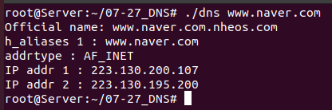

# 1. 문제

```c
#include <netdb.h>
struct hostent* gethostbyname(const char* hostname);
-> 성공 시 hostent 구조체 변수의 주소 값 반환, 실패 시 NULL 포인터 반환

struct hostent {
   char *h_name;       /* official name of host */
   char **h_aliases;   /* alias list */ -> 별칭		
   int h_addrtype;     /* host address type */
   int h_length;       /* length of address */
   char **h_addr_list; /* list of addresses */
};
```

위의 구조체를 사용해서 <br>

1. official name
2. aliases
3. addrtype
4. IP addr <br>

이렇게 아래처럼 4개의 항목을 뽑아보자 ! <br>

- 


# 2. 정답

<details>
<summary> 정답 </summary>
<div markdown="1">

```c
#include <stdio.h>
#include <stdlib.h>
#include <arpa/inet.h>
#include <netdb.h>

void error_handling(char* message);


int main(int argc, char* argv[])
{
    struct hostent* host;
    int i, j;
    i = 0;
    j = 0;


    printf("Official Name : %s \n", host->h_name);
    
    while( host->h_aliases[i] != NULL)
    {
        printf("Aliases %d : %s \n", i+1, host->h_aliases[i]);
        i++;
    }

    printf("addrtype : %s \n", host->h_addrtype == 2 ? "AF_INET" : "AF_INET6" );


    while( host->h_addr_list[j] != NULL)
    {
        printf("IP addr %d : %s \n", j+1, inet_ntoa( *(struct in_addr*)host->h_addr_list[j]));
        j++;
    }


    return 0;
}


void error_handling(char* message)
{
    fputs(message, stderr);
    fputc('\n', stderr);
    exit(1);
}


```
</div>
</details>


# 3. 피드백
- inet_ntoa 함수를 사용할 때 왜 자료형에 포인터가 들어갔을까? <br>
더블포인터 변수 h_addr_list를 사용했을 때 크기는 <span style="color:#87CEEB"> 포인터의 값인 8바이트 </span> 를 가진다. <br>
그리고 <span style="color:green"> struct in_addr 이라는 자료형 </span> 으로 바꾸려하는데 오류가 생긴다. <br>
왜냐면 포인터 변수를 다른 자료형으로 바꾸려 했기 때문에 크기가 맞지 않아서 이다.<br>
그래서 다른 자료형을 <span style="color:yellow"> 똑같이 포인터로 바꿔서 </span> 크기를 맞추었기때문에 <span style="color:orange"> 포인터로 캐스팅 </span> 했어야 했다 ! 